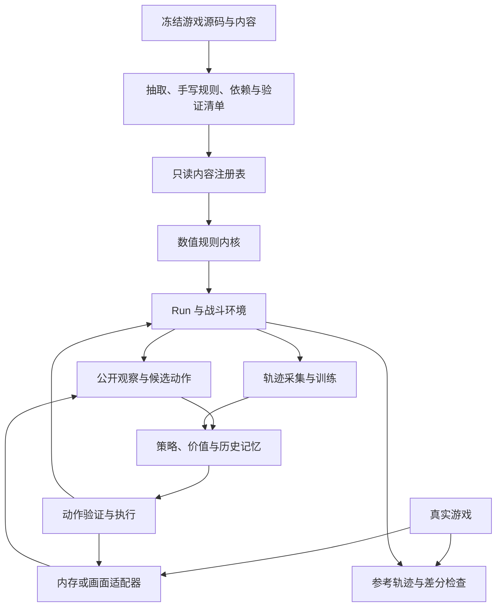
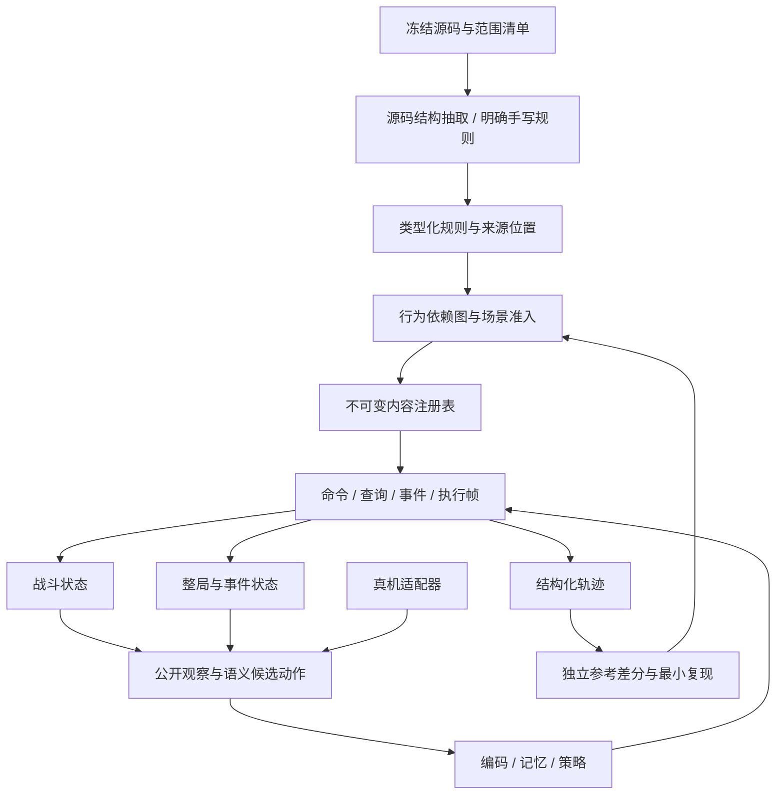

# 13 · 实施规划与当前缺口

> **当前证据更新于 2026-09-30。** 总体设计保留，当前实现尚未满足全部架构契约。
> [架构复核](15-架构复核-2026-09-22.md) 的 R1–R5 已修复并有回归；
> 最新批次见 [整改记录 §2.44](12-审计与整改记录.md)：
> **W03 前两项落地** —— P09 `parry` + P10 `seeking_edge`：两个**纯标记**能力
> （源码注释写明"自己不做事，由 `SovereignBlade` 读它"）连同**消费者**一起接上 ——
> `SovereignBlade` 的格挡 = 招架层数（抽取器跟一层方法体抓到 `self_power/parry` 公式）、
> 有锐锋时目标从单体变全体（`core.card_target`，伤害落点跟着一起变）。
> 卡牌可执行 376→**378**、能力 237→**239**；同批修正两处**过期断言**
> （`parry` 的准入断言、`audit_power_hooks` 只扫 Python 源码的消费者判据，见 §2.44.2）。
> **W03 的 P11–P13 未做**（`conqueror` / `furnace` / `sword_sage`）：分别缺
> "带卡来源的伤害倍率"、"`ForgeCmd` 本体"、"卡实例的重放数"。
> 上一批 §2.43 **W02 收口** —— P08 `entropy` 交付：回合开始挑 `Amount` 张手牌**原位随机转化**
> （`CardCmd.TransformToRandom`）。
> 候选池按 `CardFactory` 的过滤链现算：换无色池的判据是 ``CardType.Quest``（卡**类型**）
> 或稀有度 ∈ {Event, Ancient, Token}；原卡不是 Status/Curse 时只允许 Common/Uncommon/Rare；
> 战斗内只要 `CanBeGeneratedInCombat`；排除原卡 id。
> 为此抽取器新增 `can_be_generated_in_combat`（596 张全部只多这一个字段，
> `false` 的 19 张与源码 19 个覆写逐一对上，旧快照留档
> `data/archive/card-transform-2026-09-30/`）；
> 引擎新增 `core.transformation_options` / `transform_card_random`、
> 选择用途 `transform`，并把回合开始的后半段拆成**步骤序列**
> （`CombatState.turn_start_step`）以便挂起后续跑。
> 卡牌可执行 375→**376**、能力 236→**237**；`unimplemented_power` 28→**26**。
> **W02（P05–P08）四项全部落地**（§2.40 / §2.42 / §2.43）。
> 上一批 §2.42 交付 **P07 `nightmare`**（选中卡的克隆快照）；§2.41 交付
> **S01 能力实例**（真机 `PowerInstanceType` 三种语义：`None` 叠层 /
> `Instanced` 每次施加新建 / `InstancedPerApplier` 按施加者归组，
> `powers[pid]` 保留为总和镜像）；§2.40 完成 **W02 前半**
> （P05 `stratagem` + P06 `foregone_conclusion`，为此补上**抽牌帧** `core.DrawFrame`、
> 统一洗牌入口 `shuffle_piles` + 钩子 `AfterShuffle`、能力动作待办 `core.PowerTask`）。
> §2.39 接通了 **W01 后半（KnowledgeDemon 三轮二选一入口）**：
> 抽取器产出 `effects_by_counter`（三组候选 + Disintegration 的 6/7/8）与
> `counter_increment`，引擎按 `enemy.ai_counters` 现算载荷、招式走完递增计数器。
> §2.38 交付了它的前置 **S02 可挂起的执行帧**；§2.37 实现了
> [剩余能力方案](17-剩余能力逐项实现方案与规划.md) **W01 的四项能力本体**
> （`mind_rot` / `waste_away` / `sloth` / `disintegration`）。
> ⚠️ 四张知识诅咒卡**不在训练池**：它们是 `CardType.Status`、`CanBeGeneratedInCombat => false`
> 的知识恶魔专属卡（本来就不进卡池）；"入口已通"指的是遭遇可跑，不是卡可训练。
> 上批已实现 Confused 抽牌随机费用；蛇眼遗物入口仍有抽取缺口。
> 当前 378 张卡、239 个能力；1341 passed、3 skipped、645 subtests passed。
> 尚缺执行帧栈、嵌套选择与完整范围 unsupported 记录；真机对拍为 0。
> 下方历史快照及未更新的“当前”措辞，以本块、当前实测表和最新批次为准。

<!-- check_docs: allow-archived-refs -->  

> **本文是唯一的计划入口。** 它由两份文档合并而成：
> [`docs/13-完整模拟器与训练实施规划.md`](archive/13-完整模拟器与训练实施规划.md)（工单 T00–T15 与六个门槛，2026-09-18）
> 与 [`docs/16-内容填充前架构与技术规划.md`](archive/16-内容填充前架构与技术规划.md)（2026-09-19 的缺口复核、架构设计、批次 B0–B8、复现探针）。
> 两份旧文件保持原样、不再更新；**本文件 §1–§15 是旧 `docs/13` 的原文**，
> **§16–§24 是旧 `docs/16` 的原文**（只做节号平移，内容不删不改）。
>
> 代码里有 60 多处按节号引用 `docs/13`（§3.1 / §3.2 / §5 / §7 / §8.1 / §8.2 / §9 /
> §10.1 / §10.4 / §10.5 / §12.3 / §15 等）。因此 **§1–§15 的标题、编号与顺序不得改动**：
> 改一个号，那些引用就会指到错误的位置。

## 怎么读本文

| 区间 | 内容 | 性质 |
|---|---|---|
| **§1–§15** | 关键决策、总体架构、状态与生命周期、效果执行、敌人与遭遇、随机数与地图、内容准入、观察/动作/真机适配、SL 协议、模型与训练、验证与评测、性能与工程结构、工单 T00–T15 与门槛 M0–M5、完成标准 | **长期路线图**：目标态与验收条件，节号被代码引用 |
| **§16–§24** | 当前基线与覆盖快照、G01–G08 缺口复核、内容填充所需的最小架构、批次 B0–B8、Run 与 RNG 实现算法、技术栈决策、训练配合方式、验证门槛、审计快照与复现探针 | **最新缺口复核与填充批次**：进度、优先级与下一步 |

**当前状态先看头部日期及最新复核，不能笼统以 §16+ 的旧快照覆盖后续实测。** §1–§15 的长期设计与 §16+ 的历史基线发生冲突时，按源码和有日期的最新证据判断；节号保留，以免破坏代码引用。

**能力填充的执行附录**：[剩余能力逐项实现方案与规划](17-剩余能力逐项实现方案与规划.md)
按现算差集覆盖 38 个 id，逐项给出源码行为、入口、最小状态与调用位置、依赖和验收场景，
分为 11 个批次；建议先做 MindRot，再完成 KnowledgeDemon 四种减益及其选择入口。
其中 7 项入口明确限定多人，3 项待确认施加入口，2 项缺同版本源码，均未提前放行。
该附录不替换本文总体计划，也不把“能力已登记”等同于“入口/依赖闭包完整”。

### ⚠️ 必须知道的一条状态更正（旧缺口已修，不要再当待实现项）

以下五项**地图 / Boss 后继的旧缺口已经修掉**，任何文档若仍把它们列为"待实现"，那是过期信息：

1. 地图生成没有传入进阶 —— 已修（`generate_map(..., ascension=...)`）；
2. 把未知点直接当成事件 —— 已修（`UnknownMapPointOdds`，进房间那一刻才掷，概率跨房间累计）；
3. 首幕 Boss 倒下即 `PHASE_WON`（等于只有一幕）—— 已修；
4. 非最终幕 Boss 不给奖励 —— 已修（先给三选一与金币，领完才换幕）；
5. A10 `DoubleBoss` 不生效 —— 已修（先打完第二个 Boss 才换幕）。

**真正剩下的只有两项**（详见 §17 G03）：

* **按幕的遭遇队列**：源码 `ActModel.GenerateRooms()` 的弱怪 / 普通怪 / 精英序列 + 标签去重，
  卡在"源码遭遇 id → 怪物成员"的桥没搭（装载时记为 `act_encounter_ids_pending_bridge`，
  本机实测 `{overgrowth: 22, underdocks: 20, hive: 20, glory: 18}`）；
* **远古事件**：真机 `MapPointType.Ancient => RoomType.Event`（开局 `Neow` 等），
  引擎的远古点目前只作为"起点"存在，进点直接回地图。

### ⚠️ 真机对拍仍然是 0

全部内容仍是 `verified: false`。**地图的底层 PRNG 与真机不同**（§17 G07），
所以地图只能说"**结构规则一致**"（7 列、路径生成、点类型配额、剪枝、后处理与源码同名同序），
**不能**说"同种子逐点一致"。`tools/healthcheck.py` 的
「4 张幕 × 10 seed 全部从远古点连通到 Boss」也只证明连通性与结构不变量。

## 工单状态（T00–T15，按当前实测）

| 工单 | 状态 | 依据 / 剩余 |
|---|---|---|
| **T00** 冻结源码内容与需求；统一 SL 预算定义 | **已交付** | `tools/training_manifest.py`、`tests/test_training_manifest.py`。清单文件名就是内容哈希前 16 位（**引擎或内容一变就换名**，所以文档只指目录 `data/manifests/`，不指某个具体文件名）。`docs/14` §1 早期曾记 T00"部分"（清单哈希尚未落到 checkpoint），现已收口 |
| **T01** 显式内容启动、词表与准入门禁 | **部分** | 显式启动及基础门禁已交付；R3 的 Normality 查询、Run 奖励与能力生成池准入已修。§2.34 新增药水能力依赖门禁；完整范围 unsupported 记录及全内容闭包仍未完成 |
| **T02** 角色初始化及 Run↔战斗状态契约 | **部分** | Run 永久状态交接、训练角色上下文与 Run 恢复后的 RNG 外部引用均已有回归（R2/R5 已修）；后续 Osty、Forge、实例化能力仍需扩展状态契约 |
| **T03** 观察、候选、药水动作和地图边 | **部分** | 已有候选、药水和地图边；R4 已统一动态费用/可打性判据并编码能力与空球槽。尚未完成全内容观察覆盖和真机观察适配 |
| **T04** 命令上下文、钩子顺序、执行帧 | **部分** | Tainted、手动与自动出牌挂起/重复结算已修（R1）。通用执行帧栈、父子出牌资源隔离与嵌套选择仍未完成；B2 是同一剩余工作的实施批次 |
| **T05** 怪物专属状态与遭遇实例 | **已交付** | `tests/test_monster_ai_runtime.py::TestRuntimeContextIsComplete`（`docs/14` §1，审计 F05） |
| **T06** RNG、快照和参考回放 | **部分** | 已落地：`Rng` 门面（上界开区间、`NextGaussianInt` 的 `sin` 分支与银行家舍入、`StableShuffle`）、`RngSet.named()/act_map()` 派生流、战斗快照/恢复（`sts2_sim/rng.py`、`core.snapshot/restore`、`sts2_sim/env.py`）。**未做**：底层 PRNG 仍是 SHA-256 派生 + Python `random`，非 `MegaRandom`（§17 G07），"PRNG/哈希/洗牌测试向量一致"这条验收**未达成**；真机对拍 0 |
| **T07** 地图、问号、幕级序列 | **部分** | 已落地：`sts2_sim/mapgen.py`（忠实复刻 `StandardActMap`：7 列、路径生成、点类型配额、剪枝、后处理）、`sts2_sim/acts.py` + `tools/extract_acts.py` → `data/content/repo/acts_source.json`（4 张幕）、`sts2_sim/pointodds.py`（未知点掷房间）。**未做**：按幕的遭遇队列（`ActModel.GenerateRooms` 的弱怪/普通/精英序列 + 标签去重；卡在遭遇 id → 怪物成员的桥，装载时记为 `act_encounter_ids_pending_bridge`）、远古事件 |
| **T08** 奖励、遗物池、商店、事件子流程 | **部分** | 已落地：逐节点奖励预掷（`RunEnv._roll_contents`）、遗物抓包 `relicbag.py`、商店 `draw_shop_stock`、事件引擎 `events.py`（23/68 可跑、第一幕池 18）。R3 已统一 Run 奖励/商店/能力生成池准入；**未做**：奖励概率状态（`CardRarityOdds`）与生成时机未对齐；商店/转化/生成/遗物包/事件/召唤各入口未逐项检查 |
| **T09** 统一 SL 元环境和最佳轨迹提交 | **部分** | 已落地：SL 战斗 meta-episode（预算不可绕过、重开恢复同一副牌序、公开记忆保留、`_finalize` 保留最优试次；`sts2_sim/env.py`、`tests/test_sl.py`）。**未做**：SL 记录只有"每回合开始手牌"，漏掉回合内抽牌等实际可见事件；`_finalize` 直接恢复最佳结果快照，真机需要的"**重开并重放最佳动作序列**并验证到达同一公开结果"未实现（§17 G08） |
| **T10** 单角色内容依赖闭包 | **部分** | 已落地：准入门禁与闭包检查（`sts2_sim/eligibility.py`）、内容状态工具（`tools/content_status.py`、`tools/gap_report.py`）、受限课程有明确标签。**未做**：单角色"目标范围内可达内容闭包完整"未达成（`docs/12` §2.35 之后：卡 372/597、可抽池 61、能力 229/267、遗物 101/299、药水 45/64、事件 23/68；**药水 45→42 不是倒退**，而是把 3 瓶"一用即 `ValueError`"的药水如实改成残缺，见 `docs/12` §2.14.3 门禁 5；**卡 376→360 同样不是倒退**，而是把 16 张**多人专用卡**按单人 profile 排除，见 §2.32）；内容图与反向依赖传播、最短阻断链输出尚未实现（§18.6） |
| **T11** 完整幕推进和胜利条件 | **部分** | 已落地：`RunEnv._begin_act` 三幕流程、按幕选图、按幕事件池、非最终幕 Boss 给奖励、A10 双 Boss、末幕 Boss 才 `PHASE_WON`（`sts2_sim/run.py`、`tests/test_multi_act.py`）。**未做**：与 T07 相同的两项（按幕遭遇队列、远古事件）。"第一幕通过率"与"完整通关"两个指标已分开 |
| **T12** 基线训练、序列 PPO、课程和模型版本 | **部分** | 已落地：战斗层 PPO、checkpoint 自证（模型/优化器/词表/协议版本/内容哈希）、势函数塑形 γ 两处一致、环境故障与策略输局分开计数（`sts2_rl/ppo.py`、`sts2_rl/nets.py`、`tests/test_checkpoint_protocol.py`、`docs/14` §1 的"T12（部分）"）。**未做**：无 GRU / 序列训练（网络仍是无循环记忆的 Entity Transformer，约 23.1 万参数、宽度 128、3 层）、无 `curriculum.py`/`evaluation.py`、没有任何留出集上的对比实验或胜率声明（§17 G08、§22） |
| **T13** 真机只读轨迹适配与差分工具 | **未开始** | 没有 `adapters/` 包、没有 `data/reference_traces/`；`tools/saveload_probe.py` 是按 `docs/01` §1.8 写的**接口草图**，作者环境无游戏本体、**未在真机上跑过**；真机对拍 = 0 |
| **T14** 真机动作及 SL 恢复/重放 | **未开始** | 依赖 T13；真机读档是否保留随机状态等能力项仍未验证（`docs/13` §9.3） |
| **T15** 搜索增强和性能优化 | **未开始** | 代码里没有任何搜索实现（无 beam / 树搜索 / MCTS）；性能尚未按 §21.2 实测（未测纯 step、编码、推理、快照恢复、内容加载分项） |

## 当前实测证据（2026-09-30 本轮复跑）

最新批次为 `docs/12` §2.43，本轮交付 **W02 · P08 `entropy`**，**W02 四项全部落地**：
回合开始挑 `Amount` 张手牌**原位随机转化**（`CardCmd.TransformToRandom`）。
候选池按 `CardFactory` 的过滤链现算 —— 换无色池的判据是 ``CardType.Quest``
（卡**类型**）或稀有度 ∈ {Event, Ancient, Token}；原卡不是 Status/Curse 时
只允许 Common/Uncommon/Rare；战斗内只要 `CanBeGeneratedInCombat`；排除原卡 id；
再按**引擎准入**缩池并把缩池写进日志（缩完为空则如实拒绝）。
为此抽取器新增 `can_be_generated_in_combat`（596 张全部只多这一个字段、
`false` 的 19 张与源码 19 个覆写逐一对上，旧快照留档
`data/archive/card-transform-2026-09-30/`）；引擎新增
`core.transformation_options` / `transform_card_random`、选择用途 `transform`，
并把回合开始的后半段拆成**步骤序列**（`CombatState.turn_start_step`）以便挂起后续跑。
能力 236→**237**、卡牌可执行 375→**376**、`unimplemented_power` 28→**26**；
新增 14 条回归（`tests/test_entropy_transform.py`）。
⚠️ 本批踩过并钉住一个坑：一开始把 `quest` 当成**稀有度**、又误以为
Status/Curse 也走无色池，结果状态牌的候选里混进一堆状态牌（§2.43.1）。
上一批 §2.42 交付 **W02 · P07 `nightmare`**：
卡从手牌选 1 张（新选择用途 `purpose="remember"` —— **牌不移动**，只存克隆快照）、
`Apply<NightmarePower>(…).SetSelectedCard(card)` 把快照写进**刚施加的那个实例**、
下回合 `BeforeHandDraw` 克隆 `Amount` 份入手后**只移除这一个实例**；
抽取器新增 `.SetSelectedCard` → `from="remembered_card"` 的识别
（`cards_source.json` 596 张里**只有 `nightmare` 一张**变化）；
同时修正了一条**过期**的历史测试断言（`test_chained_setters` 原来拿
`SetSelectedCard` 当"认不出的 setter"的例子，它已经实现，见 §2.42.2）。
§2.41 交付 **S01 能力实例**：真机 `PowerInstanceType` 的三种语义
（`None` 叠层 / `Instanced` 每次施加新建 / `InstancedPerApplier` 按施加者归组）
现在都有实现 —— 抽取器新增 `instance_type`（23 个分实例能力），引擎新增
`PowerInstance` + 实例表 + **逐实例钩子派发**（处理器拿到的 `Amount` 是实例自己的）
+ 定向 `Remove(this)`；`powers[pid]` 保留为**总和镜像**，观察层与门槛一行未改。
新增 10 条回归（`tests/test_power_instances.py`）；该批**准入数字不变** ——
它修的是 `the_bomb` / `toric_toughness` / `oblivion` 等 23 个能力的行为。
§2.40 完成 **W02 前半**（P05 `stratagem` + P06 `foregone_conclusion`）：
两项都是"从抽牌堆挑牌入手"，为此补上
**抽牌帧**（`core.DrawFrame`，洗牌触发选择时把"还要抽几张"存下来）、
**统一洗牌入口**（`core.shuffle_piles` + 钩子 `on_after_shuffle`）与
**能力动作待办**（`core.PowerTask` + `PendingSelection.remove_power_after`），
当时能力 233→**235**、卡牌可执行 372→**374**、`unimplemented_power` 32→**28**，
新增 19 条回归（`tests/test_stratagem_draw_frame.py` 11 条 +
`tests/test_foregone_conclusion.py` 8 条）。
**W02（P05–P08）至此四项全部落地**（P08 见 §2.43）。
§2.39 接通了 **W01 后半（KnowledgeDemon 三轮二选一入口）**：
抽取器把 `CurseOfKnowledgeMove` 抽成 `effects_by_counter`（三组候选 +
Disintegration 的 **6/7/8**）与 `counter_increment`，引擎按 `enemy.ai_counters`
现算这一次的载荷、招式走完统一收尾递增计数器，新增 10 条回归
（`tests/test_knowledge_demon_entry.py`）；该批抓到并钉住两个**静默**错误：
整只怪的攻击招被贴上同一份候选、计数器名没规范化导致永远取第 0 组（§2.39.2）。
§2.38 交付了 S02 的第一种帧 **敌方回合执行帧**：怪物出招可以在
**中途停住等玩家选择**，选完由 `core._resume_enemy_turn` 接着把敌方回合跑完，
帧（`CombatState.enemy_action`）是纯数据、进得了快照；新增引擎算子 `choose_one`
（显式候选、不在任何牌堆里、选中执行它自己的效果），新增 13 条回归
（`tests/test_s02_selection_frame.py`）。
§2.37 实现了 [剩余能力方案](17-剩余能力逐项实现方案与规划.md)
**W01 的四项能力本体**（`mind_rot` / `waste_away` / `sloth` / `disintegration`）：
能力 229→**233**，新增 25 条回归（`tests/test_knowledge_demon_curses.py`），
并补上 `AfterSideTurnEndLate` 阶段（`on_side_turn_end_late`）、把抽牌修正改成
**链式**（`powers.modify_hand_draw`，顺序 = 能力施加顺序）、把 `ShouldPlay` 统一到
`core.should_play_allows`。
§2.36 完成了 38 个剩余能力的逐项方案与 11 批实施安排，仅修改文档；
§2.35 完成 Confused 的抽牌随机费用、持续时间、费用叠加顺序与快照恢复，
当时能力 228→229，新增 15 条普通回归和 8 个子测试；Confused 已不属于剩余清单。
两个蛇眼遗物仍缺辅助方法抽取及战斗中取得的时机桥接，未因能力实现而提前放行。
逐能力源码依据、依赖与验收场景见 [实施附录](17-剩余能力逐项实现方案与规划.md)。

| 检查 | 结果 |
|---|---|
| `python -X utf8 -m pytest tests -q` | **1341 passed, 3 skipped, 645 subtests passed**；16 条 warning（15 条既有 PyTorch + `.pytest_cache` 权限告警） |
| `tools/healthcheck.py --content data/content/repo` | 全部通过（33/33），含 4 张幕 × 10 seed 连通性 |
| `tools/verify_implemented.py` | 八节全部一致；比较项已包含公式 kind/arg/base/extra |
| `tools/audit_data.py --check` | 无重复、无静默丢失（本轮改了 `cards_source.json`，已重跑） |
| `tools/audit_power_refs.py --check` | 通过，读到 71 个能力 id、登记 **239** 个，全部一致 |
| `tools/audit_power_hooks.py --check` | 通过（`dead` 为空 —— 判据已加扫内容数据）；仍报告 46 条已分类未接覆写，不是零缺口 |
| `tools/content_status.py` | 卡 **378/597**（可抽池 **61**）· 敌人 115/115 · 能力 **239/267** · 遗物 **101/299 有行为（96 完全复刻）** · 药水 **45/64** · 事件 **23/68**（第一幕池 **18**）· 合格遭遇 monster 55 / elite 12 / boss 12 · 幕 4 |
| `tools/check_docs.py` | 19 份文档全部通过 |
| 训练清单 | `tools/training_manifest.py` 现算 **data/manifests/21296fcffc1e019f.json**，`--check` 通过；可抽池 61 |
| 知识恶魔实测 | 三轮候选 `(di, mind_rot)` / `(di, sloth)` / `(di, waste_away)`；Disintegration 层数 6→13→21；计数器 0→3 后切走 `>=3` 分支（§2.39.4） |
| 抽牌帧实测 | `stratagem`+`foregone_conclusion` 同时在场：先挑 1 张（Stratagem）、再挑 2 张（Foregone）、然后抽 5 张；手牌 8、抽牌堆 2（§2.40.3） |
| 能力实例实测 | 两次 `the_bomb 3` → 实例表 `[3, 3]`、镜像 6；一颗 1 层 + 一颗 3 层时前者引爆、后者剩 2；`oblivion` 同施加者叠成 5、换施加者新建（§2.41.4） |
| 梦魇实测 | 选中 `strike`（uid 2）→ 牌仍在手牌 / 能力 3 层 / 载荷 uid 13（克隆）；下回合 `added_cards` +3 且能力归零（§2.42.4） |
| 转化实测 | `entropy` 2 层：回合开始抽完牌挂起 → 选 2 张原位换成随机牌（手牌 10 张不变、`added_cards` 不变）→ 回合开始剩余步骤跑完、能力仍 2 层（§2.43.3） |
| 纯标记能力实测 | `parry` 3 层 → 打出 `sovereign_blade` 得 **3 格挡**；加 `seeking_edge` 后 `card_target` 变全体 → 两个敌人各掉 10（§2.44.4） |
| `docs/10` / `docs/14` | 均由对应工具**重生成并覆盖**（卡牌 376→378、能力 237→239） |
| 真机对拍 | **0** |

**新增药水判据**：解析出的每条 `apply_power` 都必须依赖 `powers.IMPLEMENTED` 中的能力，
否则整瓶标记残缺并拒绝使用。这不等于药水所有生成依赖都完成了闭包审计。
`tests/test_demise_potion_gate.py` 通过撤掉能力实现并重新装载，验证可用标记、动作空间与直接使用共同拒绝。

以上数字仅属于“引擎可执行 / 依赖闭包可执行”，不是认证正确数。
尚未完成的实例化能力、执行帧、历史、多段命中、Osty/Forge、地图遭遇队列和真机适配见 `docs/12` §2.35.5；
其中剩余能力的具体实施依赖和阻塞解除步骤见 [逐项方案](17-剩余能力逐项实现方案与规划.md)。

### 本轮**口径变更**（2026-09-22，外部复核 R1–R5 的整改结果）

1. **门禁覆盖所有产出内容的入口**：卡牌奖励（`run.draw_card_reward`）、商店进货
   （`run.draw_shop_stock`）、能力运行时造牌（`powers.generate_cards_to_hand`）
   统一走 `eligibility.reward_pool` / `admitted_cards` ——
   受限课程**预先缩池**并把缩池写进事件日志，**不许**"发出来再重抽"。
   依据：`docs/09` 铁律 5 + 本节 §7「闭包可执行」。
2. **可打性只有一个判据**：`core.card_playable`（= 真机 `CardModel.CanPlay`，
   CardModel.cs:1725：关键字 / 能量与星 / `ShouldPlay` / 目标可用性）。
   `legal_actions`、`step` 的非法动作校验、观察层**全部**读它 ——
   观察与合法动作互相矛盾这件事在结构上不再可能（外部复核 R4）。
3. **卡牌级 `ShouldPlay`**（`core.CARD_SHOULD_PLAY`）：`Normality` / `Enthralled`
   的封锁已实现 —— 这两张诅咒不再是"无代价"。**遗物侧**的 `ShouldPlay`
   （`velvet_choker`）仍算缺口，仍被 `content.COMBAT_PHASE_HOOKS` 拒。
4. **观察张量化**：新增能力实体 token（玩家与敌人的能力都编）与空球槽列 ——
   `NUM_FEATURES` 30 → 33、`NUM_TOKEN_TYPES` 7 → 8（都**追加在末尾**）。
   ⚠️ 特征布局变了 ⇒ **旧 checkpoint 不可复用**（见 `docs/03` §3.8 的坑）。
5. **战斗上下文是一份显式契约**：`core.CombatInit` 由 Run 与训练两条入口共用
   （角色 / 进阶 / 房间 / 遗物 / 药水 / 能量上限 / 永久生命上限）。

> ⚠️ 上面第 1 条以前的反例是「`normality` 被误放行」（原文写在这里）。
> 它现在**不再是反例**：卡牌级 `ShouldPlay` 已实现，且回归用例钉住
> （`tests/test_architecture_review_r1_r5.py::test_normality_blocks_the_fourth_play`）。
> 门禁仍然只是"可执行性"输出，**不能**据此声称与真机一致。

## 与其它文档的分工

| 文档 | 负责 |
|---|---|
| **本文 `docs/13`** | **规划与当前缺口**：工单 T00–T15、门槛、缺口复核、架构决策、内容填充批次、训练与验证方法 |
| [`docs/12`](12-审计与整改记录.md) | **审计与整改记录**：F01–F12 台账 + 各批次整改明细（含 §2.10 内容批次、§2.13 外部复核 R1–R5） |
| [`docs/14`](14-未纳入内容与共性分析.md) | **未纳入内容与共性分析**（由 `tools/gap_clusters.py --write` 生成，不要手改） |
| [`docs/15`](15-架构复核-2026-09-22.md) | **架构复核（2026-09-22）**：R1–R5 五条 P1 与可复现探针；R1–R5 已整改，明细见 `docs/12` §2.13 |
| [`docs/09`](09-保真铁律与机制清单.md) | **保真铁律与逐机制清单**（一切机制以源码为准；JSON 只给 id/类名/结构，不给数值） |
| [`docs/10`](10-残缺清单.md) | **残缺清单**（由 `tools/gap_report.py` 生成，不要手改） |
| [`AGENTS.md`](../AGENTS.md) | **工作区代理约定**（推理与说明用中文；改了文件就必须同一次任务内更新工作日志与规划文档；汇报格式与"真机对拍为 0"的红线）。与本文冲突时以它为准 |

## 两文档合并时的冲突与取舍

| # | 分歧 | 取舍 |
|---|---|---|
| 1 | 测试数字：旧 `docs/16` §16.1 记 757 passed / 2 skipped；本轮实测 758 passed / 3 skipped | 以最新实测为准；旧记录保留在 §16.1 原文里 |
| 2 | 遗物覆盖：`docs/12` 记 109/299 有行为、100 完全复刻；`docs/14` §5.7 记 92/299、85；旧 `docs/16` 记 86/299、82 | 以本轮实测 **86/299 有行为、82 完全复刻、111 种钩子 / 291 处缺口**为准。三个旧数字是不同轮次的口径，不并存为"当前值" |
| 3 | 能力：`docs/12` 记 73/267；旧 `docs/16` 与实测 95/267 | 以实测为准 |
| 4 | 事件：`docs/12` 记 12/68、第一幕池 10；旧 `docs/16` 与实测 22/68、池 18 | 以实测为准 |
| 5 | 药水：`docs/12` 记 45/64；旧 `docs/16` 与实测 45/65 | 以实测为准 |
| 6 | 卡牌：`docs/12` 的 262 是"未标残缺"的**静态标记**口径；`docs/16` 的 254/597 是"引擎可执行"的**门禁**口径 | 两个口径都保留并注明；训练门禁一律用 254/597（§7 的六状态） |
| 7 | 门槛命名撞车：`docs/13` §14 的 **M0–M5**（交付门槛）与旧 `docs/16` §8.3 的 **M0–M4**（内容填充完成定义） | 两套都保留在本文（§14 与 §23.3）；引用时必须带"§14 的 M"或"§23.3 的 M" |
| 8 | `docs/13` §14 的 T06 验收要求"PRNG/哈希/洗牌测试向量一致"；旧 `docs/16` §17 G07 记 `rng.py` 仍是 SHA-256 派生 + Python `random` | 以源码与实测为准 → **T06 记"部分"**；§6.1 的"采用源码一致的随机实现"是**目标**，不是现状 |
| 9 | `docs/13` §13 建议新增 `protocol.py` / `resolution.py` / `saveload.py` / `curriculum.py` / `evaluation.py` | 只有 `eligibility.py` 已经创建；其余按 §18.1 的"首个实际用例"创建，不预搭空模块 |
| 10 | `docs/14` §6 记"31 张可训练卡漏掉了已声明的机制变量（`Repeat` / `Increase` / `Cards`…），已定位、待修" | **已过期**：`docs/15` §2.0 / §2.2 记已修（新增"声明了机制却没被消费"的准入闸门 + 实现 `Repeat`），`tools/verify_implemented.py` 第 3 节现在 ✅ |

---

> **以下 §1–§15 为旧 `docs/13-完整模拟器与训练实施规划.md` 原文**（含其前言），
> 标题、编号与顺序一字未改，以保证代码里的 `docs/13` §N 引用仍然正确。

日期：2026-09-18。状态：架构与实施规划，尚未实施。依据：当前代码、本地反编译源码及 [本次审计报告](archive/12-现有模拟器源码审计-2026-09-18.md)。

目标是完成一个能高效产生可信训练数据的《杀戮尖塔 2》数值模拟器，训练支持重开的策略，最终通过内存/Mod 或画面适配器操控真实游戏。第一交付范围为固定版本、单人、铁甲战士、低进阶；通过验收后扩展完整幕流程、更高进阶与其它角色。

用户已确认允许重开。策略只能根据公开规则、当前玩家可见信息以及自己先前试次实际观察到的信息行动；真实种子、隐藏 RNG 状态、未揭示牌序和未来奖励均不能进入策略或规划器。

## 1. 关键决策

| 决策 | 采用方案 | 原因 |
|---|---|---|
| 模拟方式 | 无画面的数值规则模拟器 | 适合批量采样、重放、差分测试和并行训练 |
| 开发基座 | 保留当前 Python 原型，按依赖修正 | 已有机制和测试可复用；无需立即重写全项目 |
| 正确性基准 | 冻结版本源码 + 独立参考执行/真机轨迹 | 代码注释、类数量和测试数量不能单独证明正确 |
| 引擎组织 | 共享规则内核，Run/战斗状态分层，统一决策接口 | 防止永久状态丢失及效果执行路径分叉 |
| 信息隔离 | 环境内部完整状态；策略只持有不可变观察和可见历史 | 模拟器可以管理随机数，策略不能偷看随机结果 |
| SL | 环境恢复、公开记忆保留、预算显式、最佳轨迹可重放 | 训练行为必须能映射到游戏允许的实际操作 |
| 内容策略 | 可执行能力清单 + 依赖闭包 + 版本化认证 | 避免残缺内容和生成物绕过训练门禁 |
| 训练主线 | 规则基线 → 可选模仿预训练 → 战斗 PPO → 整局学习 | 先建立环境可信度，再扩大任务跨度 |
| 搜索 | 基础策略稳定后加入独立概率采样的短程搜索 | 利用数值模拟器，同时遵守未知未来信息边界 |
| 性能优化 | 测量后优化热点，必要时移植少量内核 | 当前瓶颈和正确性问题优先于语言选择 |

“怪物意图相对固定”应落实为规则状态机：固定循环、条件转移、随机分支、强制插入行动、历史限制及状态副作用。随机地图也应是受约束的生成算法，而非任意随机网格。具体规则以冻结的本地源码为准。

## 2. 总体架构



核心区分三个接口。`SimulationState` 是环境拥有的完整内部状态；`DecisionObservation` 是策略可见状态；`DecisionAction` 是根据当前观察可执行的语义动作。调试器能够读取内部状态，但不进入策略进程、训练样本特征或搜索调用链。

训练和真实游戏共用观察/动作协议。内存与画面读取只替换适配器，不要求重写策略网络。搜索使用从合法观察与历史构建的分布采样环境，不直接克隆正在游玩的隐藏状态。

## 3. 状态与生命周期

### 3.1 Run 持久状态

包含角色、进阶、幕配置、公开路径、玩家 HP/最大 HP/金币、永久牌组实例、遗物实例与持久计数、药水槽、解锁配置、已访问事件等。完整环境内部还要保存幕级遭遇/事件序列、遗物抓包、奖励概率偏移及 RNG 状态。

每个字段标明来源、生命周期和可见性。公开的计数可直接观察；能够从观察历史确定的计数可由历史推导；无法合法确定的隐藏计数只由模拟环境持有，策略在必要时维护估计分布。不能因为它是一个数值而默认公开。

### 3.2 战斗状态

战斗引用持久玩家并生成战斗卡牌副本，保留明确的永久卡牌关联。包含手牌、抽牌堆、弃牌、消耗、出牌区、能量、临时费用、状态实例、敌人实例、角色资源、当前动作执行帧及待选择请求。

进入/离开战斗采用唯一入口，禁止不同路径各自重新创建玩家：

| 数据 | 入场 | 退场 |
|---|---|---|
| 当前/最大生命 | 保留已生效数值 | 结算合法治疗和永久变化后回写 |
| 牌组升级、附魔及永久变量 | 克隆完整实例并保留关联 | 仅明确的永久改牌回写 |
| 临时费用、战斗生成牌、战斗状态 | 按源码初始化 | 按源码清理，不污染永久牌组 |
| 遗物与持久计数 | 保留实例或显式状态映射 | 回写持久字段，重置战斗字段 |
| 药水与槽位 | 共用玩家库存 | 消耗、获得、丢弃只结算一次 |
| 进阶、角色、房间类别 | 全部显式传递 | 影响源于规则，不采用统一百分比代替 |
| RNG | 使用正确所有者的流 | 保留推进后的状态，不按房间任意重置 |

验收样例包括：营火升级影响下一战；永久最大生命变化跨战斗保持；用掉药水不会在下一战回来；跨战斗遗物计数与临时重置各自正确；事件战斗结束能回到事件后续页面。

## 4. 效果执行、钩子与选择

### 4.1 保留 DSL，收紧其语义

简单效果继续由数据定义；复杂卡牌、遗物和事件可以使用显式手写处理器。暂不构建能够自动翻译全部 C# 的通用编译器。

每条效果记录动作类型、来源实体、目标选择、数值表达式、伤害/格挡属性、随机流用途、执行阶段和源码依据。数值表达式使用有限、可检查的类型，例如常量、层数、当前资源、卡牌数和有限算术组合。未支持表达式标记为缺口，不能当作 0 或删除。

抽取器作为候选数据生成器。正则匹配到命令名称不代表条件、次数、泛型参数、异步次序、继承变量和目标都已正确。复杂语法应使用有边界的解析或人工实现，必要时引入 C# 语法树工具，不继续堆叠不可验证的正则替换。

### 4.2 统一命令入口

把伤害、获得格挡、失去生命、治疗、死亡/复活、状态添加/移除、移动牌、抽牌、出牌和药水使用收敛到唯一语义入口。`ValueProp`、卡牌来源、是否攻击、是否由药水/球造成等作为上下文传递，避免通过“施法者是不是玩家”猜来源。

沿用现有 Decimal 方向，对照 C# 的计算顺序、钳制和最终取整；先修审计发现的 Tainted 加法阶段问题，再扩充修正器。按“数值查询 → 实际生效 → 事件通知”定义各入口，避免某条伤害路径绕开死亡或触发机制。

### 4.3 可暂停的执行帧

从现有 `PendingSelection` 演进到可序列化的执行帧栈。帧至少保存剩余效果、施法来源、目标、打出时资源、待落堆卡牌、选择结果和尚未触发的完成钩子。遇到玩家选择时暂停；选择完成后继续原帧；嵌套自动打牌再压入帧。

允许暂停的位置不仅是卡牌效果，还包括遗物、药水、事件、奖励和自动出牌触发。不能在效果尚未完成时触发完整的 AfterCardPlayed，也不能因嵌套选择覆盖外层待执行状态。

### 4.4 钩子总线

保留 `hooks.py` 的声明、上下文检查和 tracing。新增钩子时同时补调用位置、监听者范围、遍历顺序、查询结果聚合、变更时的枚举规则和行为用例。普通/Late 分段在有规则意义时保留；不把 Late 一律视作动画。

不要按虚方法总数机械追求覆盖率。按目标内容所依赖的有效钩子建立覆盖表，每个钩子都应能追溯到实际调用路径。

## 5. 敌人、遭遇与角色机制

怪物定义保存状态图和行为模板，怪物实例保存当前状态、已执行历史、重复次数、槽位、专属 flags/counters、召唤关系和复活状态。条件读取必须来自真实运行状态，缺少必需值直接报告 UnsupportedMechanic，不能默认 False。

验证分三层：状态转移单测、单招效果单测、完整遭遇轨迹。第一批覆盖固定循环、随机重复限制、队友数量分支、HP 阈值、召唤、死亡触发、复活和多怪槽位。Fabricator 的 `CanFabricate` 用例必须成为回归测试。

遭遇定义负责成员、实际槽位和生成规则，不能把第一个/第二个敌人索引视作通用槽位名称。召唤与移除会改变队伍数量和位置，下一次条件计算必须反映这些变化。

角色扩展在铁甲战士范围可信后进行。每个角色以“核心资源 + 可达牌池 + 初始遗物 + 特殊选择流程”作为完整单位验收。现有充能球实现可以保留，但在观察、动作、Run 交接和相关遗物全部接通之前，不把该角色算作完整支持。

## 6. 随机数、地图和整局

### 6.1 两种验证要求

**规则/分布正确**要求合法范围、概率、条件、序列约束及相关状态正确。它足以支持不依赖真机种子的随机训练。

**同种子轨迹正确**还要求字符串哈希、种子混入、整数溢出、PRNG、随机区间、洗牌算法、枚举顺序及每次消费的时机一致。它服务严格回放、差分定位和部署 SL 验证。

本项目目标内核采用源码一致的随机实现，保留环境内部随机追踪。若阶段性仍使用 Python RNG，只能标注为近似随机课程，不能宣称同种子等价；也不把 Python seed 转成真实游戏 seed 来指导决策。

### 6.2 随机所有权

保留 Run 级与玩家级流的区分；按源码补地图和内容局部 RNG。地图采用对应幕的专用生成流；战斗使用 Run 所属的相应流；事件/内容局部 RNG 单独管理。通过快照恢复所有持久流、局部流、概率状态及已消费容器。

执行日志可在验证进程记录“用途、调用序号、请求范围、消耗值”，但策略日志只记录结果揭示后玩家可知的事件。环境内部 RNG、验证日志和断言快照不得混入训练 `info` 特征。

### 6.3 地图

按冻结版本的 `StandardActMap`、`ActModel` 和后处理规则实现路径构造、交叉限制、父子/同层类型约束、特殊楼层、剪枝、可达性和幕变体。公开观察提供完整节点和边，以及游戏已展示的 Boss 等标记。

问号作为尚未解析的节点类型；进入时依据真实房间选择规则和历史概率状态解析。不能预先把全部问号当作事件。地图测试应同时检查结构不变量、节点统计和多种子参考图，而不是只检查“有路到 Boss”。

### 6.4 遭遇和奖励

幕级生成弱怪、普通怪、精英、Boss、事件等序列，保留抽取位置与重复约束；按源码的房间类型消费序列。奖励在其真实生成时机结算，使用玩家奖励流、概率偏移、角色/解锁池及遗物修正。

实现药水掉落与保底、遗物抓包与去重、金币、卡牌稀有度变化、商店卡牌/药水/遗物/删牌、营火可用选项、宝箱、开局事件及幕转换。不能将所有未访问节点的奖励提前生成并因此提前推进奖励/商店流。

### 6.5 事件与整局阶段

沿用事件图，并支持选牌子阶段、进入战斗后返回事件、转化/附魔、奖励队列与“仅执行一次”。不满足进入条件时应遵循源码的候选选择/回退规则；遇到未知机制不能悄悄跳过房间。

整局阶段至少包括开局、地图、房间、战斗、选择、奖励、幕转换、结束。第一幕结束仅是课程终点，评估指标叫“第一幕通过率”。完整通关由冻结版本的完整流程决定。

## 7. 内容准入与版本

每条内容区分以下状态，而不是用一个 `verified` 布尔值包办所有含义：

| 状态 | 证明的事情 |
|---|---|
| 已索引 | 找到类、ID、静态定义和来源 |
| 已解析 | 必需表达式与效果都被识别，无未解释片段 |
| 可执行 | 所需算子、钩子、子系统有实现 |
| 闭包可执行 | 可能生成、召唤、转化到的对象也满足准入 |
| 源码用例通过 | 针对性输入及交互与源码依据一致 |
| 参考验证通过 | 独立执行/真机轨迹在声明范围内通过 |

执行资格是内容与场景共同决定的。例如一张卡支持基础版本，不代表升级/附魔版本也支持；怪物状态机正常，不代表召唤物及整场遭遇正常。

训练配置必须明确：游戏构建、源码哈希、内容哈希、角色、解锁、进阶、幕范围、SL 协议、允许内容和课程分布。所有奖励池、商店、事件、生成卡、药水、遗物、怪物召唤共用相同门禁。

允许用受限内容做课程，但明确标为“受限模拟课程”。完整单角色训练需要覆盖该角色在目标配置下所有可达机制；不能通过删掉难实现的强牌、事件和 Boss 来声称完成真实分布。

未知机制作为环境故障单独计数并保存复现，不当作玩家死亡、胜利或正常空房。最终真实分布评测要求未知机制为零；研发期报告包含这些故障的全部起局数量，避免只保留成功执行样本造成虚高胜率。

## 8. 统一观察、动作与真实游戏适配

### 8.1 观察协议

建议 `DecisionObservation` 包含协议版本、决策阶段、公开 Run 资源、公开战斗实体、完整公开地图、当前候选列表、公开历史摘要和 SL 预算。卡牌按可见实例属性表示，包括升级、费用变化、已知永久/临时修改。状态、遗物、药水、球等采用独立实体或关系表示。

抽牌堆默认提供玩家允许查看的无序内容；如果某个效果合法揭示顶牌，显式记录该部分知识及其失效条件。历史已知顶牌不应随一次洗牌后仍被误当确定事实。

选牌候选从真实选择界面构建，包含来源牌堆、可见属性、最少/最多数量、是否允许跳过及已选集合。候选使用稳定公开排序或界面实际顺序；不能使用隐藏抽牌顺序做候选排列。

敌人意图只输出界面能显示的信息。内部 `intent_mid` 是否可用必须逐项验证：两个内部招式若当前显示相同，不能用不同内部 ID 帮模型提前分辨。图标、伤害显示和公开行动历史足够时，模型可以自行推断。

### 8.2 动作协议

动作包含类型、来源可见实体、目标、选项及当前决策标识。覆盖出牌、药水、结束回合、选牌、确认/跳过、选路、购买/删牌、营火、事件、奖励、重开、接受结果及最佳轨迹提交。

候选生成、特征编码、环境执行和真实操作使用同一套映射。候选动作必须在当前决策快照上验证，已过期动作拒绝执行。一个动作执行后等待效果结算至下一决策点，再观察；随机结果未揭示时不预先批量下发依赖该结果的后续操作。

第一版继续使用候选评分，按 batch 实际最大长度 padding。若设置工程上限，溢出必须报错并记录，不截断手牌、敌人或候选。多选通过逐项选择和确认完成，不展开所有组合。

### 8.3 真机适配器

优先制作只导出白名单字段的内存/Mod 适配器，并记录公开事件。动作通过游戏支持的命令或实际界面执行。画面适配器后续增加 OCR、卡牌/图标识别、候选定位以及翻页/悬停/打开牌堆等观察操作。

画面路线不能默认一张截图就拥有所有信息。缺失字段标 unknown，执行合理的信息查看动作后补齐；识别不稳定时重新观察。训练时先在相同结构化协议下完成策略，再用真实读取误差测试感知鲁棒性。

训练完成后才全面自动操控，但**源码与真机的验证采样应从早期开始**。先影子运行只给建议，再有限场景执行，最后完整 SL 爬塔。对拍数据只读取已发生结果，不要求向策略开放未来 RNG。

## 9. SL 作为完整环境协议

### 9.1 预算与恢复点

统一定义 `restart_budget=K` 为“初次尝试之外允许重开 K 次”，故总尝试次数最多 K+1；K=0 为 NoSL 对照。区分每节点预算和整局预算，并记录累计交互/计算开销，避免旧文档中 K=0/K=1 的含义冲突。

快照应覆盖玩家、房间、战斗、执行帧、敌人私有状态、RNG、概率偏移、奖励队列和内容消费位置。快照只能取在声明的真实可恢复点，不能默认任何中间状态都可在真机读档恢复。

### 9.2 记忆与信息边界

重开恢复环境世界状态，保留 agent 的公开经历。记录每次动作、实际揭示的抽牌、随机目标、敌人行动、结果及决策阶段，不能只记录每回合开始手牌。首次接触新局时清空跨局记忆，避免按种子记忆测试局。

世界状态重置和策略记忆重置使用两个独立标志。使用 GRU 时，重开可保留元记忆或从公开历史重建；不能因为实现沿用了 `reset()` 就丢弃合法 SL 知识。

### 9.3 保留最佳结果

训练可保存各试次快照用于加速，但最终选择的结果必须具备可执行动作轨迹。真实提交建议执行：恢复入口 → 重放选定动作 → 每步比对公开观察 → 到达结果后提交。发生分歧时停止该重放并重新决策，不能用理想快照假装成功。

“最好”需要明确准则。战斗课程可使用胜负、剩余资源等固定评价；整局策略应比较后续通关价值，因为多剩 5 HP 但耗尽药水不一定更好。记录所有资源和被选试次，避免通过单一剩血指标扭曲整局目标。

死亡后能否读档、胜利后恢复点是否仍存在、何时自动保存、读档是否保持随机状态，列为真机能力验证项，不在本次规划中假定已成立。在验证前，对相关模式标注“模拟研究”，并分别报告可部署协议的结果。

## 10. 模型与训练方法

### 10.1 模型演进

保留现有实体 Transformer + 候选动作评分模型作为基线。先补齐输入，再做以下对比：

1. 完整公开状态的无记忆模型：测量输入补全本身的收益。
2. 增加 GRU 和上一动作/公开结果：整合行动历史及随机分支证据。
3. SL 公开日志编码：区分试次、动作和观察，避免把多个试次手牌拼接成一条假想牌序。
4. 共用实体表示，增加战斗头与局外头；按阶段路由，价值预测包含完整 Run 资源。

初始可沿用宽度 128、3 层、4 个注意力头，GRU 隐藏宽度先取 128 或 256。只有独立评估显示容量不足时再升到宽度 256、4 层。不要把固定显存或参数量写成尚未实测的性能保证。

动作评分最好关联当前编码后的卡牌和目标实体，而不仅是全局向量与固定槽位 embedding。价值头明确命名为回报、终局资源或通关概率；概率头需要独立标签、损失与校准检查。

### 10.2 方法比较

| 方法 | 适用阶段 | 收益 | 主要成本或风险 | 选择 |
|---|---|---|---|---|
| 规则策略 | 最开始 | 检查环境、提供可解释基线 | 上限有限 | 必做 |
| 行为克隆 BC | 有可靠示范时 | 降低初始无效探索 | 示范覆盖偏差，不能把胜局每步都当最优 | 推荐但不阻塞 |
| Recurrent PPO + 动作掩码 | 战斗到整局 | 适配离散候选、阶段和记忆 | 长程信用分配；需连续序列训练 | 主方案 |
| DAgger 式纠错示范 | 模仿策略出现分布偏移时 | 在模型实际遇到的局面补教师动作 | 教师成本及质量 | 可选增强 |
| 短程搜索 + 价值评估 | 内核可信后 | 利用模拟器比较出牌顺序 | 分支爆炸、采样误差、隐藏状态泄漏 | 第二阶段增强 |
| 搜索策略蒸馏 | 搜索已显著强于网络时 | 将搜索收益压缩为快速决策 | 标签必须遵守相同信息边界 | 可选 |
| R2D2 类序列回放 | 采样昂贵且 PPO 数据效率不足时 | 多次利用历史序列 | 隐状态陈旧、离策略偏差、实现复杂 | 后置对比 |
| 学习世界模型 | 已有准确规则内核时 | 可研究更远期近似规划 | 累积模型误差，新增维护成本 | 第一版不需要 |

PPO 的依据是 [原始论文](https://arxiv.org/abs/1707.06347)；合法动作掩码在采样与优化时必须保持一致，见 [动作掩码研究](https://arxiv.org/abs/2006.14171)。DAgger 在策略访问到的状态上增加教师标注，见 [原始论文](https://arxiv.org/abs/1011.0686)。序列回放需要处理循环状态与参数滞后，见 [R2D2 论文](https://openreview.net/pdf/387fb2fcee8f74c53cf707a9856f40c458f33933.pdf)。以上是方法依据，不是这些方法已在本项目取得胜率的声明。

### 10.3 推荐课程

| 阶段 | 环境与数据 | 进入下一阶段的条件 |
|---|---|---|
| C0 | 小型源码用例、规则 bot、合法随机策略 | 已验证配置无未知机制，数据与动作闭环稳定 |
| C1 | 固定角色、若干已验证遭遇、真实合法牌组 | 留出遭遇/牌组上超过规则基线，执行故障为零 |
| C2 | 增加血量、升级、遗物、药水组合 | 组合用例通过；优势不只来自某一固定牌组 |
| C3 | 连续战斗，资源跨战斗保留 | 学会药水与血量取舍，持久状态无偏差 |
| C4 | 单幕选牌、路线、商店和事件 | 第一幕通过率优于同预算基线，SL 收益可复现 |
| C5 | 固定角色完整 Run，多训练种子 | 独立测试通关率提高，未知机制与协议错误为零 |
| C6 | 更多角色/进阶及真实游戏 | 分配置报告结果，真机动作与规则差分通过 |

随机牌组优先从真实或已验证的 Run 轨迹中采样。人工组合用于针对性课程和压力测试，单独标记分布；不得无条件跨角色混牌。教师、规则 bot 和搜索都只能使用合法观察。

### 10.4 奖励与长程信用分配

整局主目标是固定 SL 预算下的通关率。采用通关 1、失败 0 的终局奖励；若要优化重开次数，额外设成本并明确它改变了目标，同时报告不加成本的原始通关率。不要把“多打牌”“多造成伤害”“必花光能量”作为最终目标。

战斗课程可以用胜负和资源训练，但整局阶段不能把这些局部奖励原样累加成主目标。保留资源作为辅助预测任务，或谨慎使用势函数塑形。塑形公式为 `r' = r + gamma * Phi(next) - Phi(now)`，吸收终局的势取 0；配置 gamma 变化时两处同步。相关条件见 [奖励塑形论文](https://ai.stanford.edu/~ang/papers/shaping-icml99.pdf)。

对于有限整局，可先使用 gamma=1，配合价值回归、GAE 和逐阶段课程。战斗结束不是整局终止。若把局外决策间的一整场战斗折叠成宏步，需按实际跨度处理折扣及累计奖励，不能同时再重复计算战斗奖励。

采样窗口结束时自举价值；真正失败/通关时不自举；时间或计算预算截断单独处理。记录 final observation，避免从下一局初始状态自举。见 [Gymnasium 的终止与截断说明](https://gymnasium.farama.org/tutorials/gymnasium_basics/handling_time_limits/)。

### 10.5 序列训练与初始实验配置

Recurrent PPO 必须按连续序列训练并携带起始隐藏状态；保留环境边界与 SL 元回合边界。现有打平随机打散样本的代码只适用于无记忆基线，不能直接套到 GRU 上。

试验起点可取 16–64 个环境、每环境 rollout 128 步、序列长度 32–64、学习率 1e-4 至 3e-4、clip 0.1–0.2、每轮更新 3–4 次、GAE lambda 0.95–0.99。它们是待调参起点，不是所有硬件的承诺；优先保证数据正确、优势计算和隐藏状态处理正确。

学习器记录 KL、熵、价值误差、梯度范数、各阶段样本数、SL 次数和环境故障。网络 checkpoint 同时保存模型/优化器/调度器状态、词表、观察与动作协议版本、内容哈希、课程、训练随机状态及预算定义，支持真正恢复训练。

## 11. 搜索如何使用模拟器而不偷看

策略搜索的初态是“公开观察 + 已观察历史”，不是 live `SimulationState` 的完整副本。抽牌顺序、未公开敌人分支等从与历史一致的分布独立采样；SL 已揭示信息对分布形成约束，但动作路径改变后约束可能失效。

第一版增强可只搜索本回合确定性动作前缀，遇到新的随机揭示点时停止并用价值评估。后续再加入多个随机分支采样；同一公开信息节点必须采用相同决策规则，避免在每个采样世界中提前知道未来并选择不同动作的“预知式搜索”。

搜索输出候选动作分布或评分，再蒸馏到策略。记录搜索预算、独立随机种子和耗时；比较纯策略和搜索时同时报告环境交互量及推理成本。验证进程可以用精确隐藏状态对拍，但其结果不能成为有特权的教师动作标签。

## 12. 验证与评测体系

### 12.1 五层验证

1. **规则单元验证**：从源码构造输入和期望结果，包括边界、取整、正负状态、重复调用和空候选。
2. **组合与生命周期验证**：升级→入战；药水→退场；选牌→自动打出→死亡→完成钩子；事件→战斗→事件；SL→恢复→重放。
3. **信息边界验证**：保持全部合法历史与公开状态相同，替换隐藏 RNG/牌序/未揭示内容，观察、可见动作表示和策略分布应不变。公开状态改变则应被编码，例如中毒、升级和遗物计数。
4. **独立差分验证**：与真实游戏或受控参考执行逐步比较公开状态、事件及选择请求，定位第一处差异。测试工具可控制自己的随机输入，不将其暴露给策略。
5. **任务评估**：独立种子上的通过率、资源、SL 成本和真实执行稳定性；训练/调参/最终测试严格分开。

同种子 RNG 尚未对齐时，采用已发生公开随机结果的回放输入来验证确定性结算，另用大量独立样本验证随机分布；不要把不同随机实现造成的轨迹分叉直接归为规则错误，也不要用分布接近替代严格回放。

### 12.2 对拍记录

每条记录包含版本指纹、公开初态、动作、决策阶段、实际揭示的随机结果、事件序列和公开终态。独立保存受限调试附件供环境开发使用。先为目标范围积累至少 100 条有区分力的微场景，再覆盖整场战斗和完整 Run；数量是工作预算，不能替代覆盖质量。

严格确定性用例要求所有已纳入范围的轨迹完全一致，不设“90% 对就够”的长期门槛。随机分布检查事先规定统计量和容差，测试图结构、遭遇频率、条件概率及历史依赖，不能只检查总体均值。

### 12.3 效果指标

分别报告单战胜率、第一幕通过率、完整 Run 通关率、SL=0 对照、各 SL 预算下通关率、平均/尾部重开次数、每局环境步数和推理耗时。环境异常、未知机制、操作失败与策略输局分开计数。

模拟初评可用 500 个独立起局，最终对比建议 2,000 起局并报告二项比例置信区间；小幅提升需按目标差异扩大样本。至少用 3 个训练随机种子比较，避免只汇报最好的一个。对比策略使用相同起局集合和预算，统计单位是独立 run，不把同一局的 SL 试次当独立样本。

最小消融顺序：完整观察 vs 原始观察；无记忆 vs GRU；SL=0 vs 有限 SL；BC→PPO vs 纯 PPO；纯策略 vs 同预算搜索；阶段课程 vs 直接整局。每次只改变待验证因素。

## 13. 性能与工程结构

先分别测量规则执行、合法动作生成、观测编码、批量推理、训练更新、快照/恢复。报告“包含编码与终止处理的有效决策步/秒”，同时记录牌组/敌人规模、SL 次数、CPU、内存、GPU、进程数和内容版本。

粗略采样预算：一千万步在 500 步/秒约 5.6 小时，在 5,000 步/秒约 33 分钟；均不包含训练、评估与搜索开销，也不是本项目已达到的吞吐。先用实测确定训练预算，不沿用旧文档的单核 5k 或 50k 目标当验收事实。

优先关闭热路径文本日志、减少重复创建/解析、复用只读内容、批量推理并调整进程数。现有同步 Python 环境池可作为基线；只有测量证明 CPU 采样瓶颈时再并行或迁移热点。C#/Rust/C++ 迁移前后必须通过同一套参考轨迹。

建议按需要演进当前目录，而非一次建立所有空模块：

```text
sts2_sim/
  content.py             内容注册与能力清单
  core.py                战斗命令入口，逐步缩小职责
  run.py                 Run 生命周期与阶段机
  rng.py                 源码一致的随机流
  hooks.py               有序钩子与查询
  monster_ai.py          状态图与运行上下文
  observe.py             唯一公开投影
  protocol.py            新增：版本化观察、动作、候选及错误
  resolution.py          新增：执行帧与选择续跑
  saveload.py            新增：统一 SL 协议与公开轨迹提交
  eligibility.py         新增：内容依赖闭包与训练准入
sts2_rl/
  nets.py / ppo.py        基线保留，逐步加入序列训练
  curriculum.py          新增：明确分布的课程
  evaluation.py          新增：固定预算与留出集合评估
adapters/                后续：内存与画面适配器
tests/                   回归、组合、信息边界、参考轨迹
data/manifests/          后续：版本/哈希/范围与认证记录
data/reference_traces/  后续：已发生的公开参考轨迹
```

## 14. 实施工单与验收

| 工单 | 工作 | 前置 | 验收 |
|---|---|---|---|
| T00 | 冻结源码、内容与需求；统一 SL 预算定义 | 无 | 清单能关联构建与哈希，区分近似课程/真实范围 |
| T01 | 显式内容启动、词表与准入门禁 | T00 | builtin 不被误用于正式训练；残缺及其依赖不能进入采样 |
| T02 | 角色初始化及 Run↔战斗状态契约 | T00 | 审计的升级/HP/进阶/角色复现全部转为通过的回归 |
| T03 | 观察、候选、药水动作和地图边 | T02 | 公开状态差异可区分；隐藏差异不泄漏；选择索引一致 |
| T04 | 命令上下文、钩子顺序、执行帧 | T02 | Tainted、嵌套选择、出牌完成与死亡时序通过参考用例 |
| T05 | 怪物专属状态与遭遇实例 | T04 | 固定/条件/随机/召唤/复活用例全通过；无默认缺失标志 |
| T06 | RNG、快照和参考回放 | T00、T02 | PRNG/哈希/洗牌测试向量一致，restore 后轨迹可复现 |
| T07 | 地图、问号、幕级序列 | T05、T06 | 地图约束、遭遇推进和问号历史概率符合冻结规则 |
| T08 | 奖励、遗物池、商店、事件子流程 | T04、T06、T07 | 生成时机、概率偏移、消耗去重及事件战斗返回正确 |
| T09 | 统一 SL 元环境和最佳轨迹提交 | T03、T04、T06 | 预算不可绕过；公开记忆保留；最好试次可重放 |
| T10 | 单角色内容依赖闭包 | T01、T04、T05、T08 | 目标范围可达内容无静默缺口，受限课程有明确标签 |
| T11 | 完整幕推进和胜利条件 | T07、T08、T10 | 第一幕指标与完整通关分开，完整路径可执行 |
| T12 | 基线训练、序列 PPO、课程和模型版本 | T01、T03、T09 | 可恢复训练；有限数值；同预算评估优于规则基线 |
| T13 | 真机只读轨迹适配与差分工具 | T00、T03，可早启动 | 字段白名单和初始参考集通过，不向策略导出未来 |
| T14 | 真机动作及 SL 恢复/重放 | T09、T13 | 场景操作闭环，恢复能力实测，整局结果可追踪 |
| T15 | 搜索增强和性能优化 | 可信范围及 T12 | 相同准确性门禁下有可测收益，记录额外计算成本 |

交付顺序采用六个门槛：

- **M0：可信基线。** T00–T03，修复数据入口和状态交接；停止把静态内容数量当保真度。
- **M1：可信战斗。** T04–T06，建立小范围参考验证；T13 同期开始取证。
- **M2：可兑现 SL。** T09，统一战斗与 Run 协议，验证最佳轨迹重放与公开记忆。
- **M3：可信单幕到整局。** T07、T08、T10、T11，按闭包逐步扩大，所有范围明确标记。
- **M4：训练结果可比较。** T12，分阶段做消融、留出评估与重复训练。
- **M5：真实游戏操控。** T14，通过影子模式、有限场景、完整 SL 爬塔逐级验收；按测量决定 T15。

T12 可在 M1 已认证的战斗子集上早期进行，但不能提前宣称支持 M3 的完整游戏。真机验证采样与长期自动操控是不同工作，不必等模型很强才开始验证模拟器。

## 15. 完成标准与尚需实测的参数

“模拟器完成”以声明的游戏版本、角色、进阶、解锁和内容范围为边界：所有可达规则有实现与验证依据；整局状态流转完整；SL 恢复及提交真实可行；策略信息隔离成立；无残缺内容静默执行；参考轨迹通过；训练与部署共用协议。

“训练有效”要求在独立起局集合、相同 SL/计算预算下优于可解释基线，并报告置信区间及环境故障；模拟和真机成绩分别列出。

实施前还需记录用户实际游戏构建及其与本地源码的对应关系、目标初始解锁状态、实际硬件吞吐、真机 SL 恢复能力。它们影响配置和预算，不影响本规划的核心架构，也不需要为此暂停当前文档交付。

本次建议立即开始的实现批次是 **T00–T03 与审计中已复现的 T04/T05 回归**：先使训练读到正确内容、状态和观察，再扩展更多机制。所有旧文档中的完成率、吞吐和“一致”表述，以重新生成的证据为准。

---

> **以下 §16–§24 追加自旧 `docs/16-内容填充前架构与技术规划.md`**（只做节号平移：
> 旧 §1→§16、§2→§17、§3→§18、§4→§19、§5→§20、§6→§21、§7→§22、§8→§23、§9→§24；
> 子节号同样 +15）。内容、结论、批次清单、验收条件与源码出处均**不删不改**。

## 16. 当前基线：已取得进展，但覆盖数字仍有假阳性

> 原文日期：2026-09-19。**当时是"内容填充前的代码审计及下一阶段实施设计；本轮未修改模拟器、抽取器或训练代码"。**
> 审计期间工作区发生了外部代码更新；下文将早期快照与交付前复核分开，**已更新的结论不再作为未实现项**。

接续 §1–§15（原完整规划）、[整改记录](archive/14-审计整改记录.md) 与 [内容核对](archive/15-已实现内容核对-2026-09-19.md)。旧文档中的完成数字和“下一步”建议，以本节重新执行及源码复核的结果为准；已有历史记录保留。

**结论：保留 Python 数值模拟器，先修准入与 Run 集成，再补实例状态、可暂停执行、条件与查询钩子、观察编码，按机制批量填充内容。现在还不适合直接把剩余卡牌逐张塞进效果表，也没有证据支持先整体改写成 Rust/C++。**

范围继续沿用固定游戏版本、单人、铁甲战士与低进阶优先，然后扩展完整幕流程和其它角色。允许重开是正式需求。环境内部可以持有随机状态，策略、搜索和记忆只能使用玩家可见信息及先前尝试真正观察过的历史。接入方式仍为内存/Mod 或画面，两者共用决策协议。

### 16.1 本轮实际执行

| 检查 | 结果 | 可以证明什么 |
|---|---|---|
| `python -X utf8 tools/content_status.py` | 正常完成，见下表 | 当前加载器及准入规则给出的覆盖情况 |
| `python -X utf8 tools/verify_implemented.py --sample 8` | 八项通过 | 引擎采用的数据与同一套抽取记录一致；不能证明抽取语义正确 |
| `python -X utf8 tools/architecture_audit.py` | 正常完成 | 当前模块与源码的结构盘点 |
| 首轮 `python -m pytest tests -q` | **收集失败**：`test_run.py` 导入不存在的 `mapgen.DEFAULT_COLS` | 早期快照的问题；随后工作区更新了测试，交付前已重新执行全量检查 |
| 排除该文件后运行其余测试 | **687 passed、2 skipped、350 subtests passed**，43.99 秒 | 其余测试未发现回归；不是全量通过，也不是修复方案 |
| 工作区更新后重跑 `python -X utf8 -m pytest tests -q --maxfail=2` | **757 passed、2 skipped、350 subtests passed**，60.95 秒 | 当前快照全量测试通过；新增反例仍说明现有测试覆盖不完整 |
| 针对性只读探针 | 复现 Normality、Run 奖励门禁、编码遗漏；地图进阶传参问题在后续工作区更新后已消失 | 见 §17 与 §24 |

第二次测试命令为 `python -X utf8 -m pytest tests -q --ignore=tests/test_run.py --maxfail=4`。排除文件仅用于定位其余部分状态；交付前第三次运行已恢复全量测试，并确认旧的收集失败已消失。

> **本文件头部"当前实测证据"给出的是本次复跑的最新值：758 passed、3 skipped、350 subtests passed。**
> 上面那张表是三段历史快照（收集失败 → 687 → 757），保留原文以说明审计期间的代码更新，
> **其中的"收集失败"与"687"已经过期**。

### 16.2 覆盖快照

| 内容 | 当前工具报告 | 解读 |
|---|---:|---|
| 卡牌 | 254 / 597 可执行，332 张标记残缺 | **254 是门禁输出，不是已认证正确数**；Normality 已证明存在误放行 |
| 铁甲战士卡池 | 58 / 90 合格；奖励可抽池 53 张 | 基础牌等不属于奖励稀有度，因此两个数字不同 |
| 怪物 | 115 / 115 挂接状态机 | 不代表全部条件分支、召唤、死亡与交互已验证 |
| 能力 | 95 / 267 有实现，工具报告 75 个有测试覆盖 | “出现过测试”与完整语义覆盖不同 |
| 遗物 | 86 / 299 有行为，82 被标为完全复刻 | 条件、记账依赖及 Run 副作用仍需审计；旧文档 92 / 85 已过时 |
| 遗物钩子缺口 | 111 种、291 处 | 工具分类为 245 处直接行为、46 处记账；记账不能直接视为无关 |
| 药水 | 45 / 65 可用 | 不等于所有选择、目标和组合都已验证 |
| 事件 | 22 / 68 可跑，第一幕池 18 个 | 附魔涉及 9 个、事件战斗涉及 5 个、未抽出选项 11 个；类别有重叠 |
| 遭遇 | 普通 55、精英 12、Boss 12 个被准入 | 还需幕、解锁、进阶和生成依赖限定 |
| 真机轨迹验证 | 当前报告为 0 | 内容完成与迁移能力仍无独立参考执行证据 |

卡牌拒绝原因报告为：`effects_incomplete=332`、`unimplemented_power=250`、`effects_from_community_text=174`、`no_effects=90`、`closure_gap=4`、`triggers_incomplete=3`、`unsupported_op=1`。**同一张卡可以同时命中多个原因，不能相加。**

这些分母混合了社区表与本地源码索引。源码目录统计为 596 个卡类、268 个能力类、300 个遗物类、121 个怪物类；与运行表条数不完全相同。下一阶段先建立目标范围清单，区分正式单人内容、多人专属、废弃类、占位类、版本差异。不能为了凑齐分母强行纳入所有类。

已完成部分应保留：Run/战斗永久牌关联、角色初始参数、药水动作、选择候选一致性、手牌上限、部分怪物条件、伤害阶段、挂起后的出牌钩子，以及内容指纹框架。新工作围绕缺口推进，不推倒这些实现。

## 17. 本轮确认的重点缺口

### G01 · 准入只检查部分行为，且尚未覆盖所有内容入口【P0】

**实例一：Normality。** [源码](../data/decompiled/sts2/MegaCrit.Sts2.Core.Models.Cards/Normality.cs) 通过 `ShouldPlay` 查询本回合已开始的出牌次数，卡在手中且次数达到 3 时阻止继续出牌。当前 `card_admission("normality").admitted` 为 True；把 Normality 与四张防御放进手牌，能量设为 10，依次打出三张防御，第四张仍在合法动作里。

原因是 [准入](../sts2_sim/eligibility.py) 的“不可打出牌”例外与 [合法动作](../sts2_sim/core.py) 未覆盖卡本身的全部查询行为。**不能将不可打出等同于只有占手牌作用**。暂时拒绝这种内容，比只修掉一张卡更应优先形成通用规则。

**实例二：Run 奖励。** [draw_card_reward](../sts2_sim/run.py) 从角色原始池采样，没有使用战斗课程同一套准入。在 `RngSet(0)` 上生成 `iron_wave / thunderclap / demonic_shield`，其中 `demonic_shield` 被准入拒绝。后续商店、转化、生成、遗物包、事件及召唤入口均应逐项检查，不能由 PPO 的池子已过滤推断 Run 全部已过滤。

设计要求：把“内容本身可执行”“当前场景允许出现”“训练课程允许出现”分别定义，所有入口共享其交集。真实分布验证模式遇到不支持内容必须记为 **unsupported 场景**，不能悄悄重抽；受限课程可以预先缩池，但必须记录被改变的分布。

> **本文件书面复核（2026-09-19 本轮复跑 §24 的探针）：G01 两条实例都仍然复现** ——
> `card_admission("normality").admitted` 仍为 True，打完三张防御后第四个 `play_card` 仍在合法动作里；
> `draw_card_reward(RngSet(0))` 仍返回被拒的 `demonic_shield`。G01 未过期。

### G02 · 观察中有字段，不代表模型能使用【P0】

[featurize.py](../sts2_sim/featurize.py) 对能力仍只编码 strength、vulnerable、weak。保持其余观察和合法动作不变，把玩家中毒从无改成 9 层，所有编码数组逐元素相同；把 `orb_slots` 增加 2，编码也完全相同。

遗物当前主要编码身份，缺少公开计数；卡实例成长、临时费用与附魔尚无完整观察模型。先修这些，再开放相应内容。测试必须一路覆盖 `运行状态 → Observation → 数组 → 网络实际输入`，不能只检查 JSON 字段存在。

> **本轮复跑：G02 仍然复现** —— `poison` 与 `orb_slots` 两个公开字段的改变都没有让任何编码数组发生变化。G02 未过期。

### G03 · 地图与多幕已开始贯通，奖励和后继流程仍需补齐【P1】

[mapgen.py](../sts2_sim/mapgen.py) 和 [acts.py](../sts2_sim/acts.py) 已引入源码地图结构、幕定义、未知点、远古点、剪枝和双 Boss 参数，不能再把地图描述为旧的简单网格。

**交付前更新：**早期快照没有传入地图进阶、将未知点直接视为事件、首幕 Boss 后即通关。工作区随后更新了 [RunEnv](../sts2_sim/run.py)、[pointodds.py](../sts2_sim/pointodds.py) 及多幕测试：现在已传进阶、按幕选择地图、进入未知点时掷房间、支持 `_begin_act`。重新执行同种子探针，A0 为 61 个点且没有第二 Boss，A10 为 62 个点且第二 Boss id 为 61。以上旧缺口不再列为待实现。

**仍需处理：**非最终幕 Boss 的奖励与双 Boss 后继**已补齐**（本轮：非最终幕 Boss 先给三选一与金币，领完奖励才换幕；A10 先打第二个 Boss 才换幕；见 `docs/14` §7.2 与 `tests/test_multi_act.py`）。剩余两项：**远古点仍直接返回地图**（真机 `MapPointType.Ancient => RoomType.Event`，即开局远古事件），以及**幕遭遇仍从全局遭遇池逐节点抽样**，没有按源码 `ActModel.GenerateRooms()` 的弱怪/普通/精英队列与标签去重推进 —— 卡在"源码遭遇 id → 怪物成员"的桥没搭（`acts_source.json` 用源码 id，社区 `encounters.json` 用另一套 `eid`），装载时记为 `act_encounter_ids_pending_bridge`。

交接探针用模拟的 `done=True, won=True` 战斗结果单独测试 Run 后继逻辑：seed=1 时首幕 Boss 已生成 `cascade / crimson_mantle / midnight` 奖励，但 A0 直接进入 act=2/map；A10 即使 `second_boss=61` 也直接进入 act=2/map。此探针证明 Run 分支问题，不声称实际打赢了该战斗。

因此下一步是验证并补齐 `幕计划 → 地图 → 房间解析 → 幕队列 → Boss 奖励/第二 Boss → 下一幕`，不是重新开发已加入的地图和未知点基础算法。地图同种子一致性与未知点修正规则仍需独立参考验证。

> **本轮复跑（2026-09-19）：G03 的"仍需处理"两条都仍然成立，且旧缺口确认已修。**
> * 地图与后继：A0 = `overgrowth / None / 61 点`；A10 = `overgrowth / second_boss=61 / 62 点` —— 与上文一致；
>   `RunEnv._begin_act`、非最终幕 Boss 先给奖励、A10 双 Boss 均已在 `sts2_sim/run.py` 落地（`tests/test_multi_act.py`）。
> * `sts2_sim/run.py` 的 `ANCIENT` 分支仍是 `state.room = Room(kind=PHASE_MAP); return` —— **远古事件未建模**。
>   `acts_source.json` 已经抽出了远古事件 id（overgrowth/underdocks: `neow`；hive: `orobas / pael / tezcatara`；glory: `nonupeipe / tanx / vakuu`），但 Run 层不用它。
> * 遭遇仍是 `draw_encounter(rng, kind)` 从全局池抽（`sts2_sim/run.py:315`），
>   `content_status` 报告 `act_encounter_ids_pending_bridge = {overgrowth: 22, underdocks: 20, hive: 20, glory: 18}`。
>
> **⚠️ 五个旧缺口（未传进阶、未知点当事件、首幕 Boss 即通关、非最终幕 Boss 不给奖励、双 Boss 不生效）
> 已修掉，不得再列为待实现项。**

### G04 · 成长机制需要实例状态，不能由变量名猜行为【P1】

旧文档建议把五张 `Increase` 卡统一建模为“每次打出递增”，源码并不支持这个统一方案：

| 源码对象 | 实际规则 | 共用能力与专属差异 |
|---|---|---|
| [Rampage](../data/decompiled/sts2/MegaCrit.Sts2.Core.Models.Cards/Rampage.cs) | 伤害结算后提高**这一个实例**的伤害 | 实例变量、出牌后修改；升级/降级不能抹掉累计量 |
| [Claw](../data/decompiled/sts2/MegaCrit.Sts2.Core.Models.Cards/Claw.cs) | 结算后提高当前 `AllCards` 中所有 Claw 实例伤害 | 同类实例查询；增量由本次打出的牌决定，升级值不同 |
| [Maul](../data/decompiled/sts2/MegaCrit.Sts2.Core.Models.Cards/Maul.cs) | 两次命中后强化当前所有 Maul | 命中次数与强化次数分开，不能每段伤害都强化 |
| [KinglyPunch](../data/decompiled/sts2/MegaCrit.Sts2.Core.Models.Cards/KinglyPunch.cs) | **抽到自身时**增加伤害 | `AfterCardDrawn`，不是 OnPlay |
| [TheBall](../data/decompiled/sts2/MegaCrit.Sts2.Core.Models.Cards/TheBall.cs) | 实例成长，并有跨玩家归属/牌堆移动 | 声明 `MultiplayerOnly`；单人目标范围先排除 |

当前 [CardInstance](../sts2_sim/core.py) 有 cid、升级、uid、苦痛、永久牌关联，但还没有上述可变伤害和作用域。共享的是“可变实例 + 选择集合 + 触发时机”，不是同一条加伤公式。

### G05 · 记账会影响未来结果，必须纳入行为闭包【P1】

[Kunai](../data/decompiled/sts2/MegaCrit.Sts2.Core.Models.Relics/Kunai.cs) 的回合开始清零、攻击计数与整除触发共同构成规则；[HappyFlower](../data/decompiled/sts2/MegaCrit.Sts2.Core.Models.Relics/HappyFlower.cs) 的 TurnsSeen 是保存属性；[ArtOfWar](../data/decompiled/sts2/MegaCrit.Sts2.Core.Models.Relics/ArtOfWar.cs) 的布尔记账决定下回合能量。

当前分类把 bookkeeping 与直接效果分开，有助于统计；但 [effectful_gaps](../sts2_sim/content.py) 将记账排除，**不能由此得出可以不实现这些写入**。只有证明某字段仅影响动画/显示，且不存在规则读取，才可以忽略。

同样，“单人恒真”要有明确前置条件。`participants.Contains(Owner.Creature)` 在玩家侧与敌人侧回调中的真假不同；只有分发器已经限定到正确阵营时才可省去，不能仅凭单人模式批量剥离。这里是需要补验证的架构风险，不宣称已复现每个遗物因此出错。

### G06 · 扁平效果列表和单个 pending 无法承载后续组合【P1】

当前有选择挂起、自动出牌和部分续跑能力，但 [core._apply_effects](../sts2_sim/core.py)、[事件续页](../sts2_sim/events.py) 仍是分散的恢复路径。选择触发消耗、消耗触发抽牌、抽牌触发另一张卡，再嵌套选择时，需要保存父子执行位置与局部变量。

需要小型、可序列化的执行帧栈；不需要复刻动画协程。挂起必须发生在明确决策边界，不能在恢复时重放已执行副作用。

### G07 · RNG 与整局分布仍不相同，源码已足够开始补齐【P1】

[rng.py](../sts2_sim/rng.py) 仍使用 SHA-256 派生和 Python random。其“没有反编译出 MegaRandom”的注释已经不成立：本地存在完整 [MegaRandom.cs](../data/decompiled/sts2/MegaCrit.Sts2.Core.Random/MegaRandom.cs) 与 [Rng.cs](../data/decompiled/sts2/MegaCrit.Sts2.Core.Random/Rng.cs)。

此外，[start_combat](../sts2_sim/core.py) 每次新建 RNG 集；Run 逐节点预掷奖励，并以固定稀有度表抽取。源码 [ActModel.GenerateRooms](../data/decompiled/sts2/MegaCrit.Sts2.Core.Models/ActModel.cs:331) 维护弱敌/普通/精英队列与去重标签；[CardRarityOdds](../data/decompiled/sts2/MegaCrit.Sts2.Core.Odds/CardRarityOdds.cs) 维护会随奖励变化的概率状态。只匹配流名不能使这些分布等价。

### G08 · 证据、训练和真实接入仍有独立缺口【P1/P2】

现有数值核对从自己生成的抽取表取期望值，无法检出双方共享的遗漏；Normality 是现成反例。指纹工具采用硬编码文件列表；审计早期漏掉 acts.py，交付前工作区已经补入 acts.py 和 pointodds.py，因此不再记作当前漏项。为避免今后新增文件再次漏记，仍建议使用明确包范围的文件发现或生成清单。

网络仍是无循环记忆的 Entity Transformer；Run 没有统一的神经决策编码。SL 记录主要是各回合开始手牌，漏掉回合内抽牌等实际可见事件；`env._finalize` 直接恢复最佳结果快照。训练可以保留 best-of-K，但真机执行还需要“重开并重放最佳动作序列”，并验证能到达同一公开结果。

> **本轮书面复核：**"审计早期漏掉 acts.py"这一条**已过期**（`tools/training_manifest.py` 的引擎清单已含
> `acts.py` / `pointodds.py`），但"仍建议用包范围的文件发现"**仍成立** ——
> `tools/training_manifest.py:126` 依旧硬编码引擎文件名清单。
> 其余各条（无循环网络、Run 无统一决策编码、SL 只记回合开始手牌、`_finalize` 直接恢复快照、真机对拍 0）**均未过期**。

### G09 · 合并旧文档时**没处安放**的三条证据（本轮新增，防止随归档一起消失）

整理文档时，`docs/14` / `docs/15` 里有三条内容既不属于任何 F 编号，也不在任何一节有归宿。
它们现在收编在这里（**不是新发现，是原有记录**；详细原文见 `docs/12` §5.5 与归档文件）：

1. **充能球伤害不触发任何伤害钩子**、**`AfterDamageReceived` 在致命一击后仍触发**、
   **`AfterPowerAmountChanged` 只从 `apply_power` 路径派发** —— 三条都是审计时"发现并记录、
   未擅自动手"的既有缺口（原文在归档的 `docs/14` §5.1 末）。它们**没有 F 编号**
   （F 编号被代码引用，不能新增）。要在某一批内容里放开依赖这些钩子的卡/遗物之前，
   必须先逐条确认并补用例。
2. **`tools/extract_cards.py` 与 `data/content/repo/potions_source.json` 版本不同步** ——
   这是**工具链状态**而非引擎缺陷：抽取器比已提交的药水表新，当时只手工并入了
   `foul_potion` 一条，其余 6 瓶（`colorless_potion` / `skill_potion` / `attack_potion` /
   `gamblers_brew` / `power_potion` / `ambergris`）需要逐个审查后再整体重抽。
3. **诅咒 / 状态牌没有逐张验证** —— `content_status.py` 把它们记成"本来就无效果"，
   但它们**占用抽牌位、且部分有被动效果**（例如"不可打出"以外的行为）。
   要放开到训练集之前需要逐张核对源码。

> 这三条在 `docs/12` §5.5 有原文与坐标；本节的职责是**让它们出现在计划里**，
> 而不是随归档一起无人认领。

## 18. 内容填充所需的最小架构

> **2026-09-22 补充：[未填充内容规划复核](16-未填充内容规划复核-2026-09-22.md)。** 后续填充采用其中的继承/范围分类、能力多实例、伤害阶段、跨层结算和 C0–C6 子批次契约；本节总体分层继续有效。该补充不代表相关机制已经实现，也不更新正在修复的 bug 状态。



### 18.1 保留现有职责，按能力逐步提取

| 层 | 现有落点 | 下一步边界 |
|---|---|---|
| 内容定义 | `content.py`、`data/content/repo` | 保留静态表加载；新增规则版本、源码 span、所需能力、未解释片段 |
| 运行规则 | `core.py`、`powers.py`、`hooks.py` | 共用命令执行与查询；复杂内容使用显式注册的手写处理器 |
| 执行恢复 | 当前 pending / 自动出牌路径 | 新增小型 `execution.py`，旧效果列表作为顺序程序适配进去 |
| 实例修改 | `CardInstance`、永久牌回写 | 按实际需求扩展实例字段及生命周期，不用全局 cid 状态替代实例 |
| Run 流程 | `run.py`、`acts.py`、`events.py` | 幕与房间状态机、事件战斗返回点、奖励/概率持久状态 |
| 内容准入 | `eligibility.py` | 统一内容图、场景 profile、所有生成入口 |
| 观察/动作 | `observe.py`、`featurize.py` | 可见实例属性、能力/计数实体、变长候选，观察局部引用 |
| 验证 | `tests/`、现有审计工具 | 独立源码用例、执行轨迹、来源证书；共用生产抽取器的检查仅算管线检查 |

新增文件按首个实际用例创建；不预先搭建插件系统、通用游戏框架或全功能 C# 解释器。加载后的注册表在一次训练运行中冻结，内容变化重建准入缓存与词表。

### 18.2 状态生命周期

| 状态 | 所属层与存活范围 | 重开/战后行为 |
|---|---|---|
| 卡牌基础定义、规则程序 | 内容注册表，不可变 | 不写入单局状态 |
| 永久升级、附魔、永久变量 | Run 的卡实例，按唯一实例关联 | 跟随节点存档恢复；战后仅提交明确永久变更 |
| Rampage/Claw 等成长、临时费用、苦痛 | 战斗卡实例/具名 modifier | SL 恢复；按源码规定在回合/战斗边界过期 |
| 出牌/抽牌/引球历史及索引计数 | 战斗历史，按事件类型和 actor 索引 | SL 连同环境回滚；回合计数按准确时机重置 |
| HappyFlower 等持久计数 | 遗物实例的 Run 状态 | 跨战斗保留；SL 跟随节点状态恢复 |
| 效果局部变量、循环下标、待选择 | 执行帧 | 任意合法决策边界均可保存/恢复 |
| 幕队列、遗物包、奖励概率、随机流 | 环境 Run 私有状态 | 连同节点快照恢复，不进入策略 |
| 已经观察过的动作/结果 | 策略可见历史 | 重开不清除；新 meta-episode 清除 |

卡实例增加 `dynamic_values`、带作用域的费用/数值修正、附魔实例；每个字段有白名单 schema、默认值和过期规则。不能塞入任意 Python 对象。复制规则显式说明复制哪些属性、是否保留永久关联、是否继承成长；新生成卡不能自动继承旧实例成长。升级/降级按源码更新基础值并保留应保留的累计值。

### 18.3 受限表达式与控制流

实现有限的、可检查的规则表示，支持如下实际需求：

| 能力 | 最小表达 |
|---|---|
| 数值 | 常量、实例变量、公开/内部环境字段读取、加减乘除、min/max、显式取整 |
| 条件 | 比较、与/或/非、牌型/阵营/来源/是否同一实例 |
| 集合 | 按牌堆/类型/所有者过滤，计数，按源码顺序枚举 |
| 状态修改 | 指定实例/计数器的赋值与增量，必须声明作用域 |
| 控制流 | Sequence、If、Repeat、ForEach、Return |
| 决策与随机 | Select、具名流 Sample；两者必须独立，玩家选择不能变成随机选择 |

示意：Rampage 是 `Damage(self.damage)` 后 `AddInstanceVar(self, damage, self.increase)`；Claw 的第二步是查询当前 AllCards 的 Claw 集合后逐个修改；KinglyPunch 把修改程序挂在 `AfterCardDrawn(card == self)`。

运行期表达式可以在环境内部查询其合法规则所需状态；只有白名单投影才能离开环境。禁止把任意源码字符串 `eval` 成 Python。遇到未识别语句、未解析目标、缺失分支，编译该内容失败并留下原因，不返回 0、不默认 false、不删掉未知语句后继续认证。

[Voltaic](../data/decompiled/sts2/MegaCrit.Sts2.Core.Models.Cards/Voltaic.cs) 的循环次数先从此前的引雷球历史计算并捕获，再执行引球；不能每次循环重新读取正在增长的计数。Normality 的计算变量涉及描述展示，但真正限制来自 `ShouldPlay`。因此必须盘点完整方法和字段读写，变量名出现于 JSON 不是语义完整证明。

### 18.4 可暂停执行算法

帧最少保存 `program_id、pc、source_ref、target_refs、locals、parent、phase`。循环边界、命中次数、捕获的 X 值和选择返回值都放在帧中；引用以环境内部稳定实例 id 表示，序列化时不能依赖内存地址或 Python generator。

执行流程：取栈顶 → 执行一步或压入子帧 → 子帧完成后恢复父帧 → 遇 Select 发布选择请求并暂停 → 动作校验后写回选择结果并续跑。选择请求保存不可变候选引用、数量范围、可否跳过及顺序语义；UI 展示位置只是当前候选的局部索引。

手动打牌、自动打牌、药水、遗物和事件调用相同执行器。命令完成、一次命中、一次打牌完成分别发事件；普通 `AfterCardPlayed` 全部完成后再进入 Late 阶段，依据 [Hook.cs](../data/decompiled/sts2/MegaCrit.Sts2.Core.Hooks/Hook.cs:278)，不能对每个监听者混合执行普通与 Late。

步数上限只用于判定引擎故障/训练截断，不把超限当输牌或强行跳过效果。每次恢复应通过“无暂停执行 vs 任意决策点存取后执行”的状态与轨迹比较。

### 18.5 钩子与行为依赖

区分命令（改变状态）、事件（通知已发生）、查询（决定是否合法/数值）、派生显示（不改变规则）。同一内容可以拥有多种行为。

对每个行为记录：触发时机、作用对象、guard、读取字段、写入字段、调用命令、阶段与排序依据。字段写入只要被规则读取，就必须作为该规则的依赖。例如 Kunai 的“清零 → 计数 → 判模 → 加敏捷”是一组不可拆开的功能；不能只采纳加敏捷部分。

查询入口优先补 `ShouldPlay`、费用修正、目标合法性、抽牌数、奖励/药水/金币获取限制。出牌前检查与实际执行使用同一查询接口，自动出牌也遵守其适用规则。当前遗物“某些战斗缺口阻止数值半边”的策略应扩为整条行为依赖检查，覆盖 Run 代价。

伤害继续使用明确阶段：来源基础值、加法、乘法、限制、源码指定舍入和伤害类型；逐段伤害分别处理格挡、死亡与反击。不用“相同最终总伤害”替代“相同命中序列”。先使用 Decimal 等明确数值语义；若源码用 float/int，则保持相应类型，不将所有字段一律转 Decimal。

### 18.6 内容图与准入算法

图节点不只是一张卡，而是“内容 + 变体/行为 + 适用场景”；边包括生成牌、召唤物、施加能力、选择用途、附魔、随机池、查询与记账依赖。随机池依赖目标范围内所有可能成员，动态无法界定的池必须阻止完整准入。

采用反向依赖传播：先将缺实现/缺解析/范围不符节点标为不合格，再沿反向边传播；循环依赖可先求强连通分量，内部局部能力都满足且没有不合格外部依赖时才允许。不是遇到递归就默认通过。输出最短阻断链，例如 `事件 → 附魔 → 费用查询未实现`。

优先级依据“修复后实际新增的目标范围闭包可用场景 / 工作量”排序，再结合起始牌组、常见奖励、核心流派的使用频率；使用待修集合的去重并集，避免将一张卡的多个 blocker 重复算收益。图中假设可修复不等于已经获准，必须重新跑源用例和入口检查。

## 19. 内容填充批次与交付依赖

下面是机制顺序，不承诺未经闭包分析的“完成这批必定解锁 N 张”。第一角色仍以铁甲战士为主；Claw/KinglyPunch 等作为跨角色语义探针使用，不代表同时开启五角色训练。

| 批次 | 工作与样例 | 前置 | 验收产物 |
|---|---|---|---|
| B0 基线收口 | 验证新测试集成、修 Normality 准入、Run 奖励入口、指纹自动覆盖、编码遗漏 | 无 | 全量测试通过；新增反例回归；所有入口清单及状态 |
| B1 实例与历史 | Rampage；抽牌/出牌/伤害/引球事件；卡修改生命周期 | B0 | 状态 schema；同名实例不串值、跨战斗不误保留、SL 正确恢复 |
| B2 执行帧与查询 | 嵌套选择/自动打牌；Normality 的 ShouldPlay；事件续页 | B1 | 单一可恢复执行器、公开选择协议、动作与查询一致 |
| B3 条件遗物与能力 | Kunai、HappyFlower、ArtOfWar；牌型/阵营/计数/数值查询 | B1+B2 | 成组行为认证；各边界前后与跨战斗用例 |
| B4 集合与动态公式 | Claw、Maul、KinglyPunch、Voltaic；造牌/复制/放回/临时费用 | B2+B3 | 集合/历史表达式、升级和复制矩阵、生成闭包 |
| B5 永久改牌与事件 | 附魔、删牌/升级/转化、生成候选选取；事件战斗返回 | B2+B4 | 永久修改协议、事件→战斗→奖励/原页面完整轨迹 |
| B6 Run 分布闭环 | RNG、幕房间队列、未知点修正与对拍、奖励概率、商店、远古、Boss 后继流程 | B0 后可先做底层；依赖 B3/B5 完成交互 | 复用已加入的多幕/未知点基础实现；每个节点真实入口均通过准入 |
| B7 角色和高进阶 | 铁甲完整范围之后，再逐一开放其它角色机制、进阶、遭遇 | 对应机制及 B6 | 每个 profile 独立范围证书，不以总数替代 |
| B8 训练迁移 | 序列 PPO、整局策略、有限预算搜索、真机控制 | 协议稳定；对应训练范围通过验证 | 分组评估、SL 最佳轨迹重放、闭环真机轨迹 |

B0 不能靠只加特殊名单收工：Normality 先隔离以止损，再做“卡的所有覆写方法是否纳入规则”的通用检查。B1/B2 做最小样例贯通后即可填一批内容，不必等整个规则表示支持所有 C# 写法。

剩余能力（数量由 `tools/content_status.py` 现算）应按读写/触发需求分组：基础数值修正 → 回合/出牌触发 → 历史与实例 → 角色专属 → 跨阶段复合。不要只按 apply_power 被引用次数排序，因为卡解析失败时它的依赖可能还没进入当前效果列表。

事件按普通单页 → 多页条件/累计状态 → 选牌和永久修改 → 事件战斗 → Ancient 推进。怪物后续重点是可达招式、强制转移、历史限制、召唤后的依赖、复活/不可选中状态与进阶参数；“115 个状态机都挂上”不能成为停止补测的理由。

> **批次与当前实测的对应（本轮，不新增数字）：** B0 的"修 Normality 准入、Run 奖励入口、编码遗漏"
> 三项**尚未完成**（§17 G01/G02 仍复现）；B6 的"RNG、幕房间队列、远古"**尚未完成**（§17 G07/G03）；
> B1–B5、B7、B8 全部未开始。T04 剩余的执行帧栈已按本节 B2 处理（§18.4）。

### 19.1 buff 能力的**两波填充**（把上面第 788 行的分组落成可执行清单）

上一段说"能力应按读写/触发需求分组"，具体做法已经算出来了，见
[`docs/14` §7](14-未纳入内容与共性分析.md)（由 `tools/gap_clusters.py` 现算，不要手抄数字）：

* **Wave A —— 现有基建就能做**：展开继承行为和外部消费者，确认其所需命令、查询、状态与生命周期均已实现，才列为可直接填充。计划中的槽位不计入现有能力；名称命中也不能替代语义验证。内容填完后仍需独立用例与闭包准入。
* **Wave B —— 先补基建**：其余 buff 会落成一张"**缺失成员 → 解锁能力数**"的表
  （例如 `ModifyDamageMultiplicative` 一个倍率槽解锁 8 个能力、`BeforeHandDraw` 解锁 8 个、
  `ModifyHandDraw` 5 个、能量费用修改 6 个、`CardPlayCount` 4 个…）。
  **读法：先补左边那一列，而不是逐个啃能力。**

清单由工具生成，但判据本身仍需验证。当前生成器尚有继承扫描、计划槽位混入、多人与不可达排除证据不足等问题；见 [未填充内容规划复核](16-未填充内容规划复核-2026-09-22.md) §2。修正生成器并重新生成之前，报告仅作为人工排查线索，不能直接据此准入或承诺解锁数量。

## 20. Run 与 RNG 的实现算法

1. **统一随机后端。** 移植本地 MegaRandom 的初始化、无符号溢出、旋转、整数拒绝采样和浮点输出；从 Rng/StringHelper/RunRngSet/PlayerRngSet 逐条对齐派生方式。对照独立 C# 小程序产生固定测试向量。不能仅套用同名 xoshiro 库就宣称一致。
2. **随机流属于 Run。** 战斗借用规定的持久流；明确地图/事件独立流的创建与保存时机。每次随机请求记录用途、操作、参数、逻辑调用序号；调试日志不进入策略进程。不同后端底层消耗次数未必相同，逻辑 calls 计数相同不是位级对齐证据。
3. **幕内内容用队列/抓包与约束。** 按弱遭遇、普通、精英及标签去重生成，保留源码池顺序和洗牌顺序。地图展示结构与实际房间内容分开；未知点在规定时机用动态 odds 解析。
4. **奖励按规则时机生成。** 卡稀有度状态、药水概率、遗物包、商店及转化分别持久化。先匹配生成与状态修改时机，再检查 RNG 消耗；不能把所有未来奖励提前独立填进节点。
5. **明确终止。** 普通战斗胜利、事件内战斗、幕 Boss、第二 Boss、最终通关各有不同后继状态。事件战斗使用显式 combat context 和返回帧，奖励来源由事件/房间契约决定，不能查不到地图节点就给空奖励。
6. **解锁配置可复现。** 初期采用有名字的测试 profile，如限定角色/幕/内容的课程配置；实际账号解锁未知时不声称其分布等于真机。后续适配器读取允许的解锁信息，或使用用户明确提供的配置。

同种子对齐用于开发对拍，不要求策略知道游戏种子。策略生成未来假设时应使用独立采样的随机状态，而不是复制真机隐藏状态。同一公开历史可以对应多个未来；怪物状态机存在随机和条件分支时也如此。

## 21. 技术栈决策

### 21.1 实测环境与近期选型

当前可用环境：Python **3.11.4**、NumPy **2.4.6**、PyTorch **2.5.1+cu121**、pytest **9.1.1**，`torch.cuda.is_available()` 为 True；.NET SDK **9.0.314**。这些是本机观察值，不代表已完成依赖锁定或推荐升级版本。本轮没有安装依赖，也没有验证 GPU 性能。

| 环节 | 近期采用 | 推迟/触发条件 |
|---|---|---|
| 数值内核 | 现有 Python，dataclass、枚举、显式处理器 | profile 证明热点后再移植热点；近期不整体换语言 |
| 内容格式 | 版本化 JSON、具名规则与来源 span；十进制值用无损字符串表示 | 内容量不要求数据库服务；需要聚合时用标准库 SQLite 即可 |
| C# 结构抽取 | 小型 .NET CLI + Roslyn 语法树，先用于方法/条件/赋值/循环覆盖审计 | 不要求编译整个反编译游戏；符号不明、语法损坏则诊断并拒绝自动转换 |
| 复杂机制 | Python 手写具名 handler，与自动规则共用命令/帧/测试 | 不追求自动翻译任意 C#；所有手写规则仍绑定来源和验证案例 |
| 训练 | 保留 NumPy + PyTorch；CPU 采样、GPU 批量策略 | 先单进程基准，再按 Windows spawn 多进程扩展；暂不引入分布式训练框架 |
| 轨迹与差分 | JSONL、稳定状态归一化、pytest；先记录决策边界与关键原子事件 | 体积实测过大再换二进制格式，不先搭数据平台 |
| 工程复现 | 新增 pyproject/锁定依赖与运行 manifest，记录 CUDA/协议/profile | 先固定现有能运行的组合，不顺带升级训练栈 |
| 真机接入 | C# Mod/内存白名单适配器优先，截图适配器输出同一协议 | 先只读对拍，再开放动作执行；OCR/图像模型待真实帧样本确定 |

Roslyn 官方 API 提供解析与遍历 C# 语法树的能力，适合保留 `if/foreach/assignment/return` 的结构；**解析成功不等于语义翻译正确**。采用 CLI 导出 JSON，避免训练运行时依赖 .NET 进程。[Microsoft：语法分析](https://learn.microsoft.com/en-us/dotnet/csharp/roslyn-sdk/get-started/syntax-analysis)

这是一项渐进替换：旧抽取器继续服务已有条目，新审计器先输出“哪些方法/语句未处理”；优先迁移成长卡、条件遗物、动态公式三个问题簇。反编译源码含生成名称或缺依赖时，保留诊断并用明确手写处理器；不因完整项目编译失败阻塞内容填充。

### 21.2 性能路线

分别测量 `纯 step`、观察编码、策略推理、快照恢复、内容加载和执行轨迹开销；报告固定工作负载下每秒决策数、峰值内存、P50/P95 延迟。至少覆盖简单战斗、嵌套选择/生成、长战斗 SL，不能只测空回合。

先优化重复解析、内容缓存、无用 deepcopy 和批量编码。快照初期用正确且可验证的显式状态复制；若重开/搜索成为热点再考虑不可变共享或增量日志。只有热点明确且一致性用例通过后，才评估 C#/Rust/C++ 的小范围加速。GPU 负责策略网络，复杂分支模拟不默认搬到 GPU。

## 22. 训练与内容填充如何配合

### 22.1 网络接口先补完整，再加规模

沿用当前约 128 维、3 层 Transformer 作为初始基线，不预设增大模型。增加能力 token（类型、层数、所有者）、遗物公开计数、卡可见动态值/费用/附魔、球槽与球的公开状态；牌堆按公开可见的实例属性多重集表达，不暴露隐藏顺序。

动作由环境产生合法语义候选，候选引用当前观察中的实体/选择项；使用候选向量评分。动态 batch padding 取代依赖固定 64 动作的长期设计；过渡期超容量必须报错，不能截断。选择数量较大时可逐项选择并提供合法完成动作，是否有顺序意义由源码决定。

增加 GRU 维护动作后公开事件和 SL 历史，跨 restart 保留记忆，跨新 meta-episode 清空。训练保存序列、mask、burn-in、重开边界与终止/截断标志；不能把循环网络加入当前随机打散的 PPO minibatch 后就算完成。环境重开与策略记忆重置必须使用不同标志。

### 22.2 训练阶段

1. 规则 bot 跑通过认证的受限战斗集，统计 unsupported/故障与合法动作问题；不先把所有失败当作策略输牌。
2. 可选 BC：规则或有限预算搜索生成轨迹，所有搜索只访问公开观察及独立假设状态。先在留出场景检验示范是否比规则基线更好。
3. 战斗 PPO：冻结内容 manifest，学习出牌、选择、药水和结束回合；循环记忆加入后按完整序列训练。环境仍有缺口时只声明受限课程性能。
4. SL 课程：从 K=1 扩展至预设有限预算（例如 K=2/4），保留每次可见动作/结果。按 meta-episode 结算最佳尝试与操作成本，不能每次重开重复领取通关奖励；价值目标对应当前预算及选择规则。
5. Run 训练：在幕/奖励/事件完整范围通过后，加入路线、奖励、商店、营火和事件候选，战斗策略先冻结作为稳定基线，再逐步联合训练。
6. 搜索与蒸馏：使用 belief 中的独立未来样本做短程 beam/树搜索，按动作共享样本集合降低比较方差；限制节点数/毫秒数，最后蒸馏到策略。不得从 live `Hidden` 克隆未来；自博弈不是单人 PvE 的主要方法。

若策略根据以往重开观察推断某段牌序，应保留“在何种动作历史下看到”的条件。改变随机消费路径或重新洗牌后，旧结果不能被当作当前未来必然发生。搜索遇到等价公开历史时不能按不同隐藏样本为策略提供不同动作信息，这是避免隐藏信息泄漏的关键测试。

奖励以胜负、剩余生命、资源与明确操作成本为主，过程塑形使用公开状态势函数；失败试次的伤害/收益不能简单跨重开累加刷奖励。死亡、引擎异常、时间截断和 unsupported 分开统计，截断 bootstrap 规则与真实终止分开。

### 22.3 验证训练是否有效

按起局种子族、牌组/遗物组合、遭遇与角色 profile 划分训练和留出集，同一局的 SL 尝试不得跨集合。冻结 manifest 的规则基线、BC、无记忆 PPO、序列 PPO 用相同评估集比较。

必须报告 K=1 和相同 K/操作预算下的成功率、尝试数、用时、生命/资源、故障率及置信区间。统计独立单位是起局/meta-episode，不能把重开尝试当独立样本扩大样本量。受限池与真实目标池的结果分开，不能通过移除难牌/难怪制造“胜率提升”。

最佳尝试落地方式：保存可见动作序列及决策边界摘要，真实游戏重开至对应节点后按序重放；每步核对观察和候选，发生差异立即重新决策并记录，不能声称已实现模拟器中直接恢复快照的结果。

## 23. 验证方法与交付门槛

### 23.1 四类证据分别记账

| 证据 | 方法 | 不能替代的部分 |
|---|---|---|
| 管线一致性 | 现有 verify_implemented、schema、内容哈希 | 不验证遗漏的条件/赋值/方法 |
| 源码行为用例 | 人工从 C# 独立推导最小输入和完整执行结果 | 不等于完整游戏运行，也不是用同一抽取表生成期望 |
| 独立组件参考 | 小型 C# RNG/概率/规则 harness，来源与变更有记录 | 不自动证明 Godot 整体调度和跨模块时序 |
| 真机差分 | 同版本真机采集公开决策状态、合法动作和事件序列 | 当前尚无这一层，必须单列待完成 |

每个内容证书记录来源哈希、适用角色/进阶/变体、依赖、案例、轨迹、已知限制；源码或依赖变更后沿反向图撤销相关证书。让已有针对性源码用例真正提升相应内容的 source_case 状态，不应因还没真机对拍就将这层永远写 False。

### 23.2 首批验收案例

| 案例 | 必须检验的结果 |
|---|---|
| Normality 在手/不在手、2/3 次出牌 | 第四次出牌限制与源码一致；手动和自动路径均走查询，回合重置正确 |
| 两张 Rampage 与一张升级版 | 仅自身成长；复制/升级/降级、战后清理与 SL 恢复符合各自规则 |
| 多张 Claw/Maul 分布在不同牌堆 | 修改正确集合、增量来自本次来源牌、命中与强化次数分离 |
| KinglyPunch 回合内抽到/非抽牌移入手牌 | 只在对应抽牌事件触发；显示值与实际伤害一致 |
| Kunai 连续 2/3/4/6 次攻击，夹杂技能 | 计数、触发和跨回合清零正确；选择挂起时不提前记“完成” |
| HappyFlower 跨两场战斗与重开 | 持久计数正确；敌方回合不误增；显示值进入观察 |
| Voltaic 已引过 N 个雷球 | 捕获 N 后执行固定 N 次；不会因新引球再扩张循环 |
| 消耗→抽牌→自动打牌→选择 | 父帧位置、候选、After/Late 次数正确；恢复不重复扣能量或结算 |
| 事件→战斗→奖励/原事件 | 页面、永久状态、战斗结果和奖励归属均正确 |
| 改公开中毒/计数/成长/球槽 | 编码发生对应变化；改变隐藏牌序/随机状态而保持公开状态时编码不变 |
| 奖励/商店/转化/生成/召唤 | 每个入口尊重同一 profile；不支持内容不会静默运行或重抽 |

差分对齐按“决策边界 → 原子事件 → 状态变化”定位首个分歧，再缩短动作序列和内容组合得到最小复现。跨语言比较应归一化内部 uid、无语义日志与顺序无关集合；牌堆顺序等有语义数据不可随意排序。隐藏状态对比仅限受控开发参考，不能进入策略训练特征。

### 23.3 完成定义

> ⚠️ **命名提醒：本节的 M0–M4 是"内容填充的完成定义"，与 §14 的交付门槛 M0–M5
> 是两套不同的东西**（§14 的 M0 是"可信基线 = T00–T03"，本节 M0 是"可继续安全填充"）。
> 引用时必须写清是"§14 的 M"还是"§23.3 的 M"。两套都保留。

- **M0：可继续安全填充。** 全量测试通过；G01/G02 已有修复或明确隔离；所有入口和版本指纹完整；无“八项通过即全部正确”的表述。
- **M1：机制扩展基座可用。** B1/B2/B3 最小样例及交互通过，帧可恢复、状态生命周期明确、公开编码完整；手工源码用例独立于抽取器。
- **M2：限定范围内容完整。** 在明确单人/角色/进阶/profile 内，所有可达内容及生成依赖闭包可用；不是全表达到某个百分比。
- **M3：整局与参考对齐。** 三幕/房间/奖励/SL 可贯通，组件参考通过，并有真机代表轨迹覆盖基础行为和组合。首版可设定固定回归集，数量不能取代语义覆盖。
- **M4：训练与接入有效。** 留出评估优于同预算基线，故障/unsupported 单列；真机闭环动作确认与最佳轨迹重放完成。

下一批最具体的工作顺序：**验证地图/Run 新集成及 Boss 后继流程 → 关闭 Normality 等被动规则漏检并统一入口 → 补能力/球槽/实例公开特征 → 用 Rampage 与 Kunai 驱动状态及帧/钩子基座 → 扩展内容簇与 Run 分布。** RNG 组件对拍可以与实例规则开发并行，但共享协议和注册表变更需要单一版本协调。

> **本轮复核后的修订（不推翻上文顺序，只标注已完成项）：**
> "验证地图/Run 新集成及 Boss 后继流程"这一项**已经完成并通过**
> （§17 G03 的五个旧缺口全部修掉，`tests/test_multi_act.py` + `healthcheck` 连通性通过）。
> 因此 §23.3 的 M0 与"下一批顺序"的第一步现在可以划掉，起点是第二项
> —— **关闭 Normality 等被动规则漏检并统一所有内容入口（§17 G01）**。

## 24. 审计快照与复现

源码程序集标识为 `0.1.0+41cef1ea4657c524aa50e870df009e56337e8c32`，反编译工程声明 `netcoreapp9.0`。这是本地源码标识，**不是已核实的用户 Steam build**。

以下使用现有 `tools.training_manifest._sha256_files` 算法，对路径、文件内容一起求哈希；引擎按完整包扫描。记录初次快照及交付前复核快照，以说明审计期间代码更新造成的差异；内容表与游戏源码哈希未变。

| 范围 | 文件数 | SHA-256 |
|---|---:|---|
| `sts2_sim/**/*.py`（早期快照） | 23 | `b3e54b64c25a43061501988b68f1ddb01733b35098e59d7b25353daf6cfd4f89` |
| `sts2_sim/**/*.py`（交付前复核） | 24 | `df378b1659676a53f82534163843f0c213400500e382797d7d62c36723b39d42` |
| `sts2_rl/**/*.py` | 3 | `95848bf85c6f2e128402ef2db46de8ac837a1ebe4ed653566ec987160286b7a2` |
| `data/content/repo/**/*.json` | 27 | `89cf051c37e84935025fb6d19accce88393442bf3eda6479733bfa3cf068df6e` |
| `data/decompiled/sts2/**/*.cs` | 3538 | `95b53c580e4cff31601a4a4e0c2fb9d735cf1b7049dcd31f04ddbc5d7c895a94` |

下面代码在项目根目录用 Python 执行，只构造内存局面，不修改内容文件。它复现 G01/G02/G03；正式修复后预期输出应相应改变。

```python
from dataclasses import replace
import numpy as np
from sts2_sim.featurize import configure_content, encode_observation

configure_content("data/content/repo")
from sts2_sim import eligibility
from sts2_sim.core import CardInstance, start_combat, legal_actions, step, Action
from sts2_sim.observe import observe
from sts2_sim.rng import RngSet
from sts2_sim.run import RunEnv, draw_card_reward

s = start_combat(eligibility.random_deck_cards(), ("axebot",), seed=1)
o = observe(s)
actions = legal_actions(s)
base = encode_observation(o, actions)
for name, changed in {
    "poison": replace(o, player_powers=o.player_powers + (("poison", 9),)),
    "orb_slots": replace(o, orb_slots=o.orb_slots + 2),
}.items():
    encoded = encode_observation(changed, actions)
    print(name, [k for k in base if not np.array_equal(base[k], encoded[k])])
# 当前两项均 []：公开状态变化没有进入编码。

reward = draw_card_reward(RngSet(0))
print("reward", reward,
      "rejected", [c for c in reward if not eligibility.card_admission(c).admitted])
# 当前 rejected = ['demonic_shield']。

s = start_combat(["defend_ironclad"] * 4 + ["normality"], ("axebot",), seed=1)
s.hand = [CardInstance("normality")] + [CardInstance("defend_ironclad") for _ in range(4)]
s.draw_pile = []
s.energy = 10
for _ in range(3):
    step(s, Action("play_card", 1, -1))
print("normality admitted", eligibility.card_admission("normality").admitted)
print("after three plays", legal_actions(s))
# 当前 True，且仍包含 play_card(hand=1,target=-1)。

for ascension in (0, 10):
    env = RunEnv(seed=1, ascension=ascension)
    env.reset()
    graph = env.raw_state.map
    print(ascension, graph.act_id, graph.second_boss, len(graph.nodes))
# 交付前更新后：A0 = overgrowth / None / 61；A10 = overgrowth / 61 / 62。
```

本规划没有把“当前未发现错误”提升为“已完整复刻”。后续以每批实际增加的闭包场景、独立验证证据和整局可达性作为进度依据。

> **2026-09-19 本轮复跑结果（原样记录，供下次对比）：**
>
> ```text
> ENC poison []
> ENC orb_slots []
> REWARD ('iron_wave', 'thunderclap', 'demonic_shield') rejected ['demonic_shield']
> NORMALITY admitted True
> AFTER3 [play_card(hand=1,target=-1), end_turn]
> MAP 0 overgrowth None 61
> MAP 10 overgrowth 61 62
> ```
>
> 即：**G01（两条实例）、G02 仍然复现，未修**；**G03 的地图/后继部分与原文一致，旧缺口确认已修**。
> （`AFTER3` 里的 `play_card(hand=1)` 就是手里剩下的第四张防御 —— 三张打完后它仍然合法，
> 说明 `ShouldPlay` 的限制没有生效。）

---

## 附：本文合并所依据的最新实测（口径与本节一致）

| 项目 | 值 |
|---|---|
| `python -m pytest tests -q` | 1041 passed, 3 skipped, 511 subtests passed |
| `tools/healthcheck.py --content data/content/repo` | 33/33 通过；"4 张幕 × 10 seed 全部从远古点连通到 Boss（无孤立点）" |
| `tools/verify_implemented.py` | 八节全 ✅ |
| `tools/audit_data.py --check` | ✅ |
| `tools/content_status.py` | 卡牌 347/597（可抽池 58）· 敌人 115/115 · 能力 197/267 · 遗物 90/299 有行为（85 完全复刻）· 药水 45/65 · 事件 22/68（池 18）· 遭遇 monster 55 / elite 12 / boss 12 · 幕 4 |
| `act_encounter_ids_pending_bridge` | `{overgrowth: 22, underdocks: 20, hive: 20, glory: 18}` |
| 训练清单 | 清单文件名 = 内容哈希前 16 位（随引擎/内容变化），本轮为 `data/manifests/bf80d9d3eaa87fc5.json`，与当前源码/内容/引擎一致 |
| 真机对拍 | **0**（地图只能说"结构规则一致"，不能说同种子逐点一致） |
