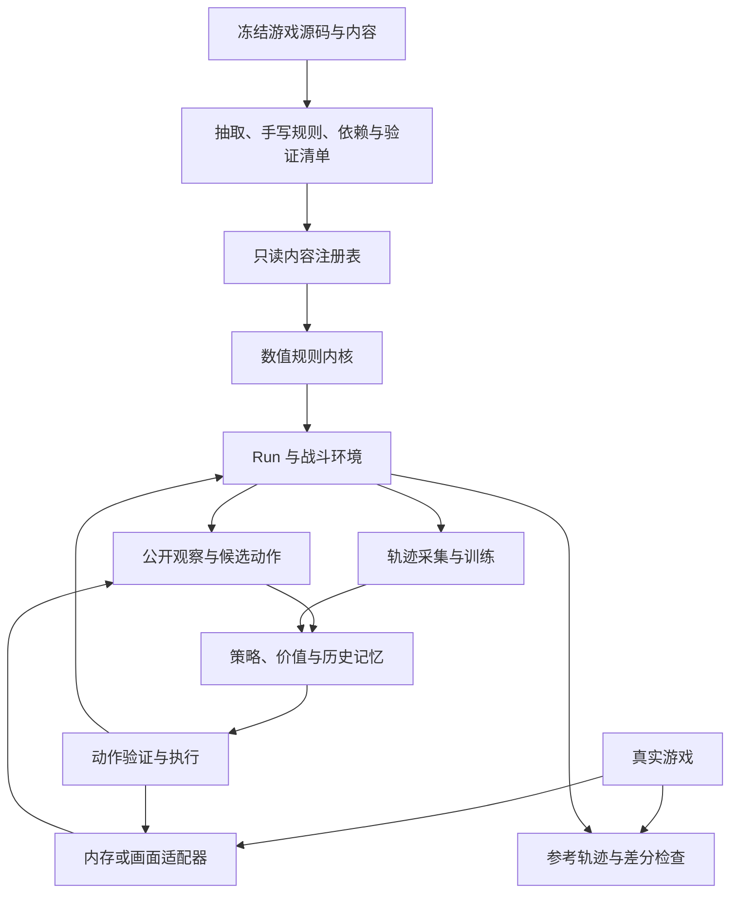

> 🗄️ **已归档（不再维护）。**工单 T00–T15 与门槛 M0–M5 已**原样保留**在新 docs/13 的 §1–§15，另追加了最新缺口复核。
>
> 合并去向：[13-实施规划与当前缺口.md](../13-实施规划与当前缺口.md)。
> 文中的完成度数字、结论与"下一步"都停留在写作当时；文内的 docs/NN 引用按**当时编号**，
> 不保证现在还能解析。要当前状态请看 [docs/08](../08-代码地图与运行说明.md) 的命令、
> [docs/13](../13-实施规划与当前缺口.md)（计划）与 [docs/12](../12-审计与整改记录.md)（整改）。

# 13 · 完整模拟器与训练实施规划

日期：2026-09-18。状态：架构与实施规划，尚未实施。依据：当前代码、本地反编译源码及 [本次审计报告](D:/桌面/尖塔模型/docs/12-现有模拟器源码审计-2026-09-18.md)。

目标是完成一个能高效产生可信训练数据的《杀戮尖塔 2》数值模拟器，训练支持重开的策略，最终通过内存/Mod 或画面适配器操控真实游戏。第一交付范围为固定版本、单人、铁甲战士、低进阶；通过验收后扩展完整幕流程、更高进阶与其它角色。

用户已确认允许重开。策略只能根据公开规则、当前玩家可见信息以及自己先前试次实际观察到的信息行动；真实种子、隐藏 RNG 状态、未揭示牌序和未来奖励均不能进入策略或规划器。

## 1. 关键决策

| 决策 | 采用方案 | 原因 |
|---|---|---|
| 模拟方式 | 无画面的数值规则模拟器 | 适合批量采样、重放、差分测试和并行训练 |
| 开发基座 | 保留当前 Python 原型，按依赖修正 | 已有机制和测试可复用；无需立即重写全项目 |
| 正确性基准 | 冻结版本源码 + 独立参考执行/真机轨迹 | 代码注释、类数量和测试数量不能单独证明正确 |
| 引擎组织 | 共享规则内核，Run/战斗状态分层，统一决策接口 | 防止永久状态丢失及效果执行路径分叉 |
| 信息隔离 | 环境内部完整状态；策略只持有不可变观察和可见历史 | 模拟器可以管理随机数，策略不能偷看随机结果 |
| SL | 环境恢复、公开记忆保留、预算显式、最佳轨迹可重放 | 训练行为必须能映射到游戏允许的实际操作 |
| 内容策略 | 可执行能力清单 + 依赖闭包 + 版本化认证 | 避免残缺内容和生成物绕过训练门禁 |
| 训练主线 | 规则基线 → 可选模仿预训练 → 战斗 PPO → 整局学习 | 先建立环境可信度，再扩大任务跨度 |
| 搜索 | 基础策略稳定后加入独立概率采样的短程搜索 | 利用数值模拟器，同时遵守未知未来信息边界 |
| 性能优化 | 测量后优化热点，必要时移植少量内核 | 当前瓶颈和正确性问题优先于语言选择 |

“怪物意图相对固定”应落实为规则状态机：固定循环、条件转移、随机分支、强制插入行动、历史限制及状态副作用。随机地图也应是受约束的生成算法，而非任意随机网格。具体规则以冻结的本地源码为准。

## 2. 总体架构



核心区分三个接口。`SimulationState` 是环境拥有的完整内部状态；`DecisionObservation` 是策略可见状态；`DecisionAction` 是根据当前观察可执行的语义动作。调试器能够读取内部状态，但不进入策略进程、训练样本特征或搜索调用链。

训练和真实游戏共用观察/动作协议。内存与画面读取只替换适配器，不要求重写策略网络。搜索使用从合法观察与历史构建的分布采样环境，不直接克隆正在游玩的隐藏状态。

## 3. 状态与生命周期

### 3.1 Run 持久状态

包含角色、进阶、幕配置、公开路径、玩家 HP/最大 HP/金币、永久牌组实例、遗物实例与持久计数、药水槽、解锁配置、已访问事件等。完整环境内部还要保存幕级遭遇/事件序列、遗物抓包、奖励概率偏移及 RNG 状态。

每个字段标明来源、生命周期和可见性。公开的计数可直接观察；能够从观察历史确定的计数可由历史推导；无法合法确定的隐藏计数只由模拟环境持有，策略在必要时维护估计分布。不能因为它是一个数值而默认公开。

### 3.2 战斗状态

战斗引用持久玩家并生成战斗卡牌副本，保留明确的永久卡牌关联。包含手牌、抽牌堆、弃牌、消耗、出牌区、能量、临时费用、状态实例、敌人实例、角色资源、当前动作执行帧及待选择请求。

进入/离开战斗采用唯一入口，禁止不同路径各自重新创建玩家：

| 数据 | 入场 | 退场 |
|---|---|---|
| 当前/最大生命 | 保留已生效数值 | 结算合法治疗和永久变化后回写 |
| 牌组升级、附魔及永久变量 | 克隆完整实例并保留关联 | 仅明确的永久改牌回写 |
| 临时费用、战斗生成牌、战斗状态 | 按源码初始化 | 按源码清理，不污染永久牌组 |
| 遗物与持久计数 | 保留实例或显式状态映射 | 回写持久字段，重置战斗字段 |
| 药水与槽位 | 共用玩家库存 | 消耗、获得、丢弃只结算一次 |
| 进阶、角色、房间类别 | 全部显式传递 | 影响源于规则，不采用统一百分比代替 |
| RNG | 使用正确所有者的流 | 保留推进后的状态，不按房间任意重置 |

验收样例包括：营火升级影响下一战；永久最大生命变化跨战斗保持；用掉药水不会在下一战回来；跨战斗遗物计数与临时重置各自正确；事件战斗结束能回到事件后续页面。

## 4. 效果执行、钩子与选择

### 4.1 保留 DSL，收紧其语义

简单效果继续由数据定义；复杂卡牌、遗物和事件可以使用显式手写处理器。暂不构建能够自动翻译全部 C# 的通用编译器。

每条效果记录动作类型、来源实体、目标选择、数值表达式、伤害/格挡属性、随机流用途、执行阶段和源码依据。数值表达式使用有限、可检查的类型，例如常量、层数、当前资源、卡牌数和有限算术组合。未支持表达式标记为缺口，不能当作 0 或删除。

抽取器作为候选数据生成器。正则匹配到命令名称不代表条件、次数、泛型参数、异步次序、继承变量和目标都已正确。复杂语法应使用有边界的解析或人工实现，必要时引入 C# 语法树工具，不继续堆叠不可验证的正则替换。

### 4.2 统一命令入口

把伤害、获得格挡、失去生命、治疗、死亡/复活、状态添加/移除、移动牌、抽牌、出牌和药水使用收敛到唯一语义入口。`ValueProp`、卡牌来源、是否攻击、是否由药水/球造成等作为上下文传递，避免通过“施法者是不是玩家”猜来源。

沿用现有 Decimal 方向，对照 C# 的计算顺序、钳制和最终取整；先修审计发现的 Tainted 加法阶段问题，再扩充修正器。按“数值查询 → 实际生效 → 事件通知”定义各入口，避免某条伤害路径绕开死亡或触发机制。

### 4.3 可暂停的执行帧

从现有 `PendingSelection` 演进到可序列化的执行帧栈。帧至少保存剩余效果、施法来源、目标、打出时资源、待落堆卡牌、选择结果和尚未触发的完成钩子。遇到玩家选择时暂停；选择完成后继续原帧；嵌套自动打牌再压入帧。

允许暂停的位置不仅是卡牌效果，还包括遗物、药水、事件、奖励和自动出牌触发。不能在效果尚未完成时触发完整的 AfterCardPlayed，也不能因嵌套选择覆盖外层待执行状态。

### 4.4 钩子总线

保留 `hooks.py` 的声明、上下文检查和 tracing。新增钩子时同时补调用位置、监听者范围、遍历顺序、查询结果聚合、变更时的枚举规则和行为用例。普通/Late 分段在有规则意义时保留；不把 Late 一律视作动画。

不要按虚方法总数机械追求覆盖率。按目标内容所依赖的有效钩子建立覆盖表，每个钩子都应能追溯到实际调用路径。

## 5. 敌人、遭遇与角色机制

怪物定义保存状态图和行为模板，怪物实例保存当前状态、已执行历史、重复次数、槽位、专属 flags/counters、召唤关系和复活状态。条件读取必须来自真实运行状态，缺少必需值直接报告 UnsupportedMechanic，不能默认 False。

验证分三层：状态转移单测、单招效果单测、完整遭遇轨迹。第一批覆盖固定循环、随机重复限制、队友数量分支、HP 阈值、召唤、死亡触发、复活和多怪槽位。Fabricator 的 `CanFabricate` 用例必须成为回归测试。

遭遇定义负责成员、实际槽位和生成规则，不能把第一个/第二个敌人索引视作通用槽位名称。召唤与移除会改变队伍数量和位置，下一次条件计算必须反映这些变化。

角色扩展在铁甲战士范围可信后进行。每个角色以“核心资源 + 可达牌池 + 初始遗物 + 特殊选择流程”作为完整单位验收。现有充能球实现可以保留，但在观察、动作、Run 交接和相关遗物全部接通之前，不把该角色算作完整支持。

## 6. 随机数、地图和整局

### 6.1 两种验证要求

**规则/分布正确**要求合法范围、概率、条件、序列约束及相关状态正确。它足以支持不依赖真机种子的随机训练。

**同种子轨迹正确**还要求字符串哈希、种子混入、整数溢出、PRNG、随机区间、洗牌算法、枚举顺序及每次消费的时机一致。它服务严格回放、差分定位和部署 SL 验证。

本项目目标内核采用源码一致的随机实现，保留环境内部随机追踪。若阶段性仍使用 Python RNG，只能标注为近似随机课程，不能宣称同种子等价；也不把 Python seed 转成真实游戏 seed 来指导决策。

### 6.2 随机所有权

保留 Run 级与玩家级流的区分；按源码补地图和内容局部 RNG。地图采用对应幕的专用生成流；战斗使用 Run 所属的相应流；事件/内容局部 RNG 单独管理。通过快照恢复所有持久流、局部流、概率状态及已消费容器。

执行日志可在验证进程记录“用途、调用序号、请求范围、消耗值”，但策略日志只记录结果揭示后玩家可知的事件。环境内部 RNG、验证日志和断言快照不得混入训练 `info` 特征。

### 6.3 地图

按冻结版本的 `StandardActMap`、`ActModel` 和后处理规则实现路径构造、交叉限制、父子/同层类型约束、特殊楼层、剪枝、可达性和幕变体。公开观察提供完整节点和边，以及游戏已展示的 Boss 等标记。

问号作为尚未解析的节点类型；进入时依据真实房间选择规则和历史概率状态解析。不能预先把全部问号当作事件。地图测试应同时检查结构不变量、节点统计和多种子参考图，而不是只检查“有路到 Boss”。

### 6.4 遭遇和奖励

幕级生成弱怪、普通怪、精英、Boss、事件等序列，保留抽取位置与重复约束；按源码的房间类型消费序列。奖励在其真实生成时机结算，使用玩家奖励流、概率偏移、角色/解锁池及遗物修正。

实现药水掉落与保底、遗物抓包与去重、金币、卡牌稀有度变化、商店卡牌/药水/遗物/删牌、营火可用选项、宝箱、开局事件及幕转换。不能将所有未访问节点的奖励提前生成并因此提前推进奖励/商店流。

### 6.5 事件与整局阶段

沿用事件图，并支持选牌子阶段、进入战斗后返回事件、转化/附魔、奖励队列与“仅执行一次”。不满足进入条件时应遵循源码的候选选择/回退规则；遇到未知机制不能悄悄跳过房间。

整局阶段至少包括开局、地图、房间、战斗、选择、奖励、幕转换、结束。第一幕结束仅是课程终点，评估指标叫“第一幕通过率”。完整通关由冻结版本的完整流程决定。

## 7. 内容准入与版本

每条内容区分以下状态，而不是用一个 `verified` 布尔值包办所有含义：

| 状态 | 证明的事情 |
|---|---|
| 已索引 | 找到类、ID、静态定义和来源 |
| 已解析 | 必需表达式与效果都被识别，无未解释片段 |
| 可执行 | 所需算子、钩子、子系统有实现 |
| 闭包可执行 | 可能生成、召唤、转化到的对象也满足准入 |
| 源码用例通过 | 针对性输入及交互与源码依据一致 |
| 参考验证通过 | 独立执行/真机轨迹在声明范围内通过 |

执行资格是内容与场景共同决定的。例如一张卡支持基础版本，不代表升级/附魔版本也支持；怪物状态机正常，不代表召唤物及整场遭遇正常。

训练配置必须明确：游戏构建、源码哈希、内容哈希、角色、解锁、进阶、幕范围、SL 协议、允许内容和课程分布。所有奖励池、商店、事件、生成卡、药水、遗物、怪物召唤共用相同门禁。

允许用受限内容做课程，但明确标为“受限模拟课程”。完整单角色训练需要覆盖该角色在目标配置下所有可达机制；不能通过删掉难实现的强牌、事件和 Boss 来声称完成真实分布。

未知机制作为环境故障单独计数并保存复现，不当作玩家死亡、胜利或正常空房。最终真实分布评测要求未知机制为零；研发期报告包含这些故障的全部起局数量，避免只保留成功执行样本造成虚高胜率。

## 8. 统一观察、动作与真实游戏适配

### 8.1 观察协议

建议 `DecisionObservation` 包含协议版本、决策阶段、公开 Run 资源、公开战斗实体、完整公开地图、当前候选列表、公开历史摘要和 SL 预算。卡牌按可见实例属性表示，包括升级、费用变化、已知永久/临时修改。状态、遗物、药水、球等采用独立实体或关系表示。

抽牌堆默认提供玩家允许查看的无序内容；如果某个效果合法揭示顶牌，显式记录该部分知识及其失效条件。历史已知顶牌不应随一次洗牌后仍被误当确定事实。

选牌候选从真实选择界面构建，包含来源牌堆、可见属性、最少/最多数量、是否允许跳过及已选集合。候选使用稳定公开排序或界面实际顺序；不能使用隐藏抽牌顺序做候选排列。

敌人意图只输出界面能显示的信息。内部 `intent_mid` 是否可用必须逐项验证：两个内部招式若当前显示相同，不能用不同内部 ID 帮模型提前分辨。图标、伤害显示和公开行动历史足够时，模型可以自行推断。

### 8.2 动作协议

动作包含类型、来源可见实体、目标、选项及当前决策标识。覆盖出牌、药水、结束回合、选牌、确认/跳过、选路、购买/删牌、营火、事件、奖励、重开、接受结果及最佳轨迹提交。

候选生成、特征编码、环境执行和真实操作使用同一套映射。候选动作必须在当前决策快照上验证，已过期动作拒绝执行。一个动作执行后等待效果结算至下一决策点，再观察；随机结果未揭示时不预先批量下发依赖该结果的后续操作。

第一版继续使用候选评分，按 batch 实际最大长度 padding。若设置工程上限，溢出必须报错并记录，不截断手牌、敌人或候选。多选通过逐项选择和确认完成，不展开所有组合。

### 8.3 真机适配器

优先制作只导出白名单字段的内存/Mod 适配器，并记录公开事件。动作通过游戏支持的命令或实际界面执行。画面适配器后续增加 OCR、卡牌/图标识别、候选定位以及翻页/悬停/打开牌堆等观察操作。

画面路线不能默认一张截图就拥有所有信息。缺失字段标 unknown，执行合理的信息查看动作后补齐；识别不稳定时重新观察。训练时先在相同结构化协议下完成策略，再用真实读取误差测试感知鲁棒性。

训练完成后才全面自动操控，但**源码与真机的验证采样应从早期开始**。先影子运行只给建议，再有限场景执行，最后完整 SL 爬塔。对拍数据只读取已发生结果，不要求向策略开放未来 RNG。

## 9. SL 作为完整环境协议

### 9.1 预算与恢复点

统一定义 `restart_budget=K` 为“初次尝试之外允许重开 K 次”，故总尝试次数最多 K+1；K=0 为 NoSL 对照。区分每节点预算和整局预算，并记录累计交互/计算开销，避免旧文档中 K=0/K=1 的含义冲突。

快照应覆盖玩家、房间、战斗、执行帧、敌人私有状态、RNG、概率偏移、奖励队列和内容消费位置。快照只能取在声明的真实可恢复点，不能默认任何中间状态都可在真机读档恢复。

### 9.2 记忆与信息边界

重开恢复环境世界状态，保留 agent 的公开经历。记录每次动作、实际揭示的抽牌、随机目标、敌人行动、结果及决策阶段，不能只记录每回合开始手牌。首次接触新局时清空跨局记忆，避免按种子记忆测试局。

世界状态重置和策略记忆重置使用两个独立标志。使用 GRU 时，重开可保留元记忆或从公开历史重建；不能因为实现沿用了 `reset()` 就丢弃合法 SL 知识。

### 9.3 保留最佳结果

训练可保存各试次快照用于加速，但最终选择的结果必须具备可执行动作轨迹。真实提交建议执行：恢复入口 → 重放选定动作 → 每步比对公开观察 → 到达结果后提交。发生分歧时停止该重放并重新决策，不能用理想快照假装成功。

“最好”需要明确准则。战斗课程可使用胜负、剩余资源等固定评价；整局策略应比较后续通关价值，因为多剩 5 HP 但耗尽药水不一定更好。记录所有资源和被选试次，避免通过单一剩血指标扭曲整局目标。

死亡后能否读档、胜利后恢复点是否仍存在、何时自动保存、读档是否保持随机状态，列为真机能力验证项，不在本次规划中假定已成立。在验证前，对相关模式标注“模拟研究”，并分别报告可部署协议的结果。

## 10. 模型与训练方法

### 10.1 模型演进

保留现有实体 Transformer + 候选动作评分模型作为基线。先补齐输入，再做以下对比：

1. 完整公开状态的无记忆模型：测量输入补全本身的收益。
2. 增加 GRU 和上一动作/公开结果：整合行动历史及随机分支证据。
3. SL 公开日志编码：区分试次、动作和观察，避免把多个试次手牌拼接成一条假想牌序。
4. 共用实体表示，增加战斗头与局外头；按阶段路由，价值预测包含完整 Run 资源。

初始可沿用宽度 128、3 层、4 个注意力头，GRU 隐藏宽度先取 128 或 256。只有独立评估显示容量不足时再升到宽度 256、4 层。不要把固定显存或参数量写成尚未实测的性能保证。

动作评分最好关联当前编码后的卡牌和目标实体，而不仅是全局向量与固定槽位 embedding。价值头明确命名为回报、终局资源或通关概率；概率头需要独立标签、损失与校准检查。

### 10.2 方法比较

| 方法 | 适用阶段 | 收益 | 主要成本或风险 | 选择 |
|---|---|---|---|---|
| 规则策略 | 最开始 | 检查环境、提供可解释基线 | 上限有限 | 必做 |
| 行为克隆 BC | 有可靠示范时 | 降低初始无效探索 | 示范覆盖偏差，不能把胜局每步都当最优 | 推荐但不阻塞 |
| Recurrent PPO + 动作掩码 | 战斗到整局 | 适配离散候选、阶段和记忆 | 长程信用分配；需连续序列训练 | 主方案 |
| DAgger 式纠错示范 | 模仿策略出现分布偏移时 | 在模型实际遇到的局面补教师动作 | 教师成本及质量 | 可选增强 |
| 短程搜索 + 价值评估 | 内核可信后 | 利用模拟器比较出牌顺序 | 分支爆炸、采样误差、隐藏状态泄漏 | 第二阶段增强 |
| 搜索策略蒸馏 | 搜索已显著强于网络时 | 将搜索收益压缩为快速决策 | 标签必须遵守相同信息边界 | 可选 |
| R2D2 类序列回放 | 采样昂贵且 PPO 数据效率不足时 | 多次利用历史序列 | 隐状态陈旧、离策略偏差、实现复杂 | 后置对比 |
| 学习世界模型 | 已有准确规则内核时 | 可研究更远期近似规划 | 累积模型误差，新增维护成本 | 第一版不需要 |

PPO 的依据是 [原始论文](https://arxiv.org/abs/1707.06347)；合法动作掩码在采样与优化时必须保持一致，见 [动作掩码研究](https://arxiv.org/abs/2006.14171)。DAgger 在策略访问到的状态上增加教师标注，见 [原始论文](https://arxiv.org/abs/1011.0686)。序列回放需要处理循环状态与参数滞后，见 [R2D2 论文](https://openreview.net/pdf/387fb2fcee8f74c53cf707a9856f40c458f33933.pdf)。以上是方法依据，不是这些方法已在本项目取得胜率的声明。

### 10.3 推荐课程

| 阶段 | 环境与数据 | 进入下一阶段的条件 |
|---|---|---|
| C0 | 小型源码用例、规则 bot、合法随机策略 | 已验证配置无未知机制，数据与动作闭环稳定 |
| C1 | 固定角色、若干已验证遭遇、真实合法牌组 | 留出遭遇/牌组上超过规则基线，执行故障为零 |
| C2 | 增加血量、升级、遗物、药水组合 | 组合用例通过；优势不只来自某一固定牌组 |
| C3 | 连续战斗，资源跨战斗保留 | 学会药水与血量取舍，持久状态无偏差 |
| C4 | 单幕选牌、路线、商店和事件 | 第一幕通过率优于同预算基线，SL 收益可复现 |
| C5 | 固定角色完整 Run，多训练种子 | 独立测试通关率提高，未知机制与协议错误为零 |
| C6 | 更多角色/进阶及真实游戏 | 分配置报告结果，真机动作与规则差分通过 |

随机牌组优先从真实或已验证的 Run 轨迹中采样。人工组合用于针对性课程和压力测试，单独标记分布；不得无条件跨角色混牌。教师、规则 bot 和搜索都只能使用合法观察。

### 10.4 奖励与长程信用分配

整局主目标是固定 SL 预算下的通关率。采用通关 1、失败 0 的终局奖励；若要优化重开次数，额外设成本并明确它改变了目标，同时报告不加成本的原始通关率。不要把“多打牌”“多造成伤害”“必花光能量”作为最终目标。

战斗课程可以用胜负和资源训练，但整局阶段不能把这些局部奖励原样累加成主目标。保留资源作为辅助预测任务，或谨慎使用势函数塑形。塑形公式为 `r' = r + gamma * Phi(next) - Phi(now)`，吸收终局的势取 0；配置 gamma 变化时两处同步。相关条件见 [奖励塑形论文](https://ai.stanford.edu/~ang/papers/shaping-icml99.pdf)。

对于有限整局，可先使用 gamma=1，配合价值回归、GAE 和逐阶段课程。战斗结束不是整局终止。若把局外决策间的一整场战斗折叠成宏步，需按实际跨度处理折扣及累计奖励，不能同时再重复计算战斗奖励。

采样窗口结束时自举价值；真正失败/通关时不自举；时间或计算预算截断单独处理。记录 final observation，避免从下一局初始状态自举。见 [Gymnasium 的终止与截断说明](https://gymnasium.farama.org/tutorials/gymnasium_basics/handling_time_limits/)。

### 10.5 序列训练与初始实验配置

Recurrent PPO 必须按连续序列训练并携带起始隐藏状态；保留环境边界与 SL 元回合边界。现有打平随机打散样本的代码只适用于无记忆基线，不能直接套到 GRU 上。

试验起点可取 16–64 个环境、每环境 rollout 128 步、序列长度 32–64、学习率 1e-4 至 3e-4、clip 0.1–0.2、每轮更新 3–4 次、GAE lambda 0.95–0.99。它们是待调参起点，不是所有硬件的承诺；优先保证数据正确、优势计算和隐藏状态处理正确。

学习器记录 KL、熵、价值误差、梯度范数、各阶段样本数、SL 次数和环境故障。网络 checkpoint 同时保存模型/优化器/调度器状态、词表、观察与动作协议版本、内容哈希、课程、训练随机状态及预算定义，支持真正恢复训练。

## 11. 搜索如何使用模拟器而不偷看

策略搜索的初态是“公开观察 + 已观察历史”，不是 live `SimulationState` 的完整副本。抽牌顺序、未公开敌人分支等从与历史一致的分布独立采样；SL 已揭示信息对分布形成约束，但动作路径改变后约束可能失效。

第一版增强可只搜索本回合确定性动作前缀，遇到新的随机揭示点时停止并用价值评估。后续再加入多个随机分支采样；同一公开信息节点必须采用相同决策规则，避免在每个采样世界中提前知道未来并选择不同动作的“预知式搜索”。

搜索输出候选动作分布或评分，再蒸馏到策略。记录搜索预算、独立随机种子和耗时；比较纯策略和搜索时同时报告环境交互量及推理成本。验证进程可以用精确隐藏状态对拍，但其结果不能成为有特权的教师动作标签。

## 12. 验证与评测体系

### 12.1 五层验证

1. **规则单元验证**：从源码构造输入和期望结果，包括边界、取整、正负状态、重复调用和空候选。
2. **组合与生命周期验证**：升级→入战；药水→退场；选牌→自动打出→死亡→完成钩子；事件→战斗→事件；SL→恢复→重放。
3. **信息边界验证**：保持全部合法历史与公开状态相同，替换隐藏 RNG/牌序/未揭示内容，观察、可见动作表示和策略分布应不变。公开状态改变则应被编码，例如中毒、升级和遗物计数。
4. **独立差分验证**：与真实游戏或受控参考执行逐步比较公开状态、事件及选择请求，定位第一处差异。测试工具可控制自己的随机输入，不将其暴露给策略。
5. **任务评估**：独立种子上的通过率、资源、SL 成本和真实执行稳定性；训练/调参/最终测试严格分开。

同种子 RNG 尚未对齐时，采用已发生公开随机结果的回放输入来验证确定性结算，另用大量独立样本验证随机分布；不要把不同随机实现造成的轨迹分叉直接归为规则错误，也不要用分布接近替代严格回放。

### 12.2 对拍记录

每条记录包含版本指纹、公开初态、动作、决策阶段、实际揭示的随机结果、事件序列和公开终态。独立保存受限调试附件供环境开发使用。先为目标范围积累至少 100 条有区分力的微场景，再覆盖整场战斗和完整 Run；数量是工作预算，不能替代覆盖质量。

严格确定性用例要求所有已纳入范围的轨迹完全一致，不设“90% 对就够”的长期门槛。随机分布检查事先规定统计量和容差，测试图结构、遭遇频率、条件概率及历史依赖，不能只检查总体均值。

### 12.3 效果指标

分别报告单战胜率、第一幕通过率、完整 Run 通关率、SL=0 对照、各 SL 预算下通关率、平均/尾部重开次数、每局环境步数和推理耗时。环境异常、未知机制、操作失败与策略输局分开计数。

模拟初评可用 500 个独立起局，最终对比建议 2,000 起局并报告二项比例置信区间；小幅提升需按目标差异扩大样本。至少用 3 个训练随机种子比较，避免只汇报最好的一个。对比策略使用相同起局集合和预算，统计单位是独立 run，不把同一局的 SL 试次当独立样本。

最小消融顺序：完整观察 vs 原始观察；无记忆 vs GRU；SL=0 vs 有限 SL；BC→PPO vs 纯 PPO；纯策略 vs 同预算搜索；阶段课程 vs 直接整局。每次只改变待验证因素。

## 13. 性能与工程结构

先分别测量规则执行、合法动作生成、观测编码、批量推理、训练更新、快照/恢复。报告“包含编码与终止处理的有效决策步/秒”，同时记录牌组/敌人规模、SL 次数、CPU、内存、GPU、进程数和内容版本。

粗略采样预算：一千万步在 500 步/秒约 5.6 小时，在 5,000 步/秒约 33 分钟；均不包含训练、评估与搜索开销，也不是本项目已达到的吞吐。先用实测确定训练预算，不沿用旧文档的单核 5k 或 50k 目标当验收事实。

优先关闭热路径文本日志、减少重复创建/解析、复用只读内容、批量推理并调整进程数。现有同步 Python 环境池可作为基线；只有测量证明 CPU 采样瓶颈时再并行或迁移热点。C#/Rust/C++ 迁移前后必须通过同一套参考轨迹。

建议按需要演进当前目录，而非一次建立所有空模块：

```text
sts2_sim/
  content.py             内容注册与能力清单
  core.py                战斗命令入口，逐步缩小职责
  run.py                 Run 生命周期与阶段机
  rng.py                 源码一致的随机流
  hooks.py               有序钩子与查询
  monster_ai.py          状态图与运行上下文
  observe.py             唯一公开投影
  protocol.py            新增：版本化观察、动作、候选及错误
  resolution.py          新增：执行帧与选择续跑
  saveload.py            新增：统一 SL 协议与公开轨迹提交
  eligibility.py         新增：内容依赖闭包与训练准入
sts2_rl/
  nets.py / ppo.py        基线保留，逐步加入序列训练
  curriculum.py          新增：明确分布的课程
  evaluation.py          新增：固定预算与留出集合评估
adapters/                后续：内存与画面适配器
tests/                   回归、组合、信息边界、参考轨迹
data/manifests/          后续：版本/哈希/范围与认证记录
data/reference_traces/  后续：已发生的公开参考轨迹
```

## 14. 实施工单与验收

| 工单 | 工作 | 前置 | 验收 |
|---|---|---|---|
| T00 | 冻结源码、内容与需求；统一 SL 预算定义 | 无 | 清单能关联构建与哈希，区分近似课程/真实范围 |
| T01 | 显式内容启动、词表与准入门禁 | T00 | builtin 不被误用于正式训练；残缺及其依赖不能进入采样 |
| T02 | 角色初始化及 Run↔战斗状态契约 | T00 | 审计的升级/HP/进阶/角色复现全部转为通过的回归 |
| T03 | 观察、候选、药水动作和地图边 | T02 | 公开状态差异可区分；隐藏差异不泄漏；选择索引一致 |
| T04 | 命令上下文、钩子顺序、执行帧 | T02 | Tainted、嵌套选择、出牌完成与死亡时序通过参考用例 |
| T05 | 怪物专属状态与遭遇实例 | T04 | 固定/条件/随机/召唤/复活用例全通过；无默认缺失标志 |
| T06 | RNG、快照和参考回放 | T00、T02 | PRNG/哈希/洗牌测试向量一致，restore 后轨迹可复现 |
| T07 | 地图、问号、幕级序列 | T05、T06 | 地图约束、遭遇推进和问号历史概率符合冻结规则 |
| T08 | 奖励、遗物池、商店、事件子流程 | T04、T06、T07 | 生成时机、概率偏移、消耗去重及事件战斗返回正确 |
| T09 | 统一 SL 元环境和最佳轨迹提交 | T03、T04、T06 | 预算不可绕过；公开记忆保留；最好试次可重放 |
| T10 | 单角色内容依赖闭包 | T01、T04、T05、T08 | 目标范围可达内容无静默缺口，受限课程有明确标签 |
| T11 | 完整幕推进和胜利条件 | T07、T08、T10 | 第一幕指标与完整通关分开，完整路径可执行 |
| T12 | 基线训练、序列 PPO、课程和模型版本 | T01、T03、T09 | 可恢复训练；有限数值；同预算评估优于规则基线 |
| T13 | 真机只读轨迹适配与差分工具 | T00、T03，可早启动 | 字段白名单和初始参考集通过，不向策略导出未来 |
| T14 | 真机动作及 SL 恢复/重放 | T09、T13 | 场景操作闭环，恢复能力实测，整局结果可追踪 |
| T15 | 搜索增强和性能优化 | 可信范围及 T12 | 相同准确性门禁下有可测收益，记录额外计算成本 |

交付顺序采用六个门槛：

- **M0：可信基线。** T00–T03，修复数据入口和状态交接；停止把静态内容数量当保真度。
- **M1：可信战斗。** T04–T06，建立小范围参考验证；T13 同期开始取证。
- **M2：可兑现 SL。** T09，统一战斗与 Run 协议，验证最佳轨迹重放与公开记忆。
- **M3：可信单幕到整局。** T07、T08、T10、T11，按闭包逐步扩大，所有范围明确标记。
- **M4：训练结果可比较。** T12，分阶段做消融、留出评估与重复训练。
- **M5：真实游戏操控。** T14，通过影子模式、有限场景、完整 SL 爬塔逐级验收；按测量决定 T15。

T12 可在 M1 已认证的战斗子集上早期进行，但不能提前宣称支持 M3 的完整游戏。真机验证采样与长期自动操控是不同工作，不必等模型很强才开始验证模拟器。

## 15. 完成标准与尚需实测的参数

“模拟器完成”以声明的游戏版本、角色、进阶、解锁和内容范围为边界：所有可达规则有实现与验证依据；整局状态流转完整；SL 恢复及提交真实可行；策略信息隔离成立；无残缺内容静默执行；参考轨迹通过；训练与部署共用协议。

“训练有效”要求在独立起局集合、相同 SL/计算预算下优于可解释基线，并报告置信区间及环境故障；模拟和真机成绩分别列出。

实施前还需记录用户实际游戏构建及其与本地源码的对应关系、目标初始解锁状态、实际硬件吞吐、真机 SL 恢复能力。它们影响配置和预算，不影响本规划的核心架构，也不需要为此暂停当前文档交付。

本次建议立即开始的实现批次是 **T00–T03 与审计中已复现的 T04/T05 回归**：先使训练读到正确内容、状态和观察，再扩展更多机制。所有旧文档中的完成率、吞吐和“一致”表述，以重新生成的证据为准。
