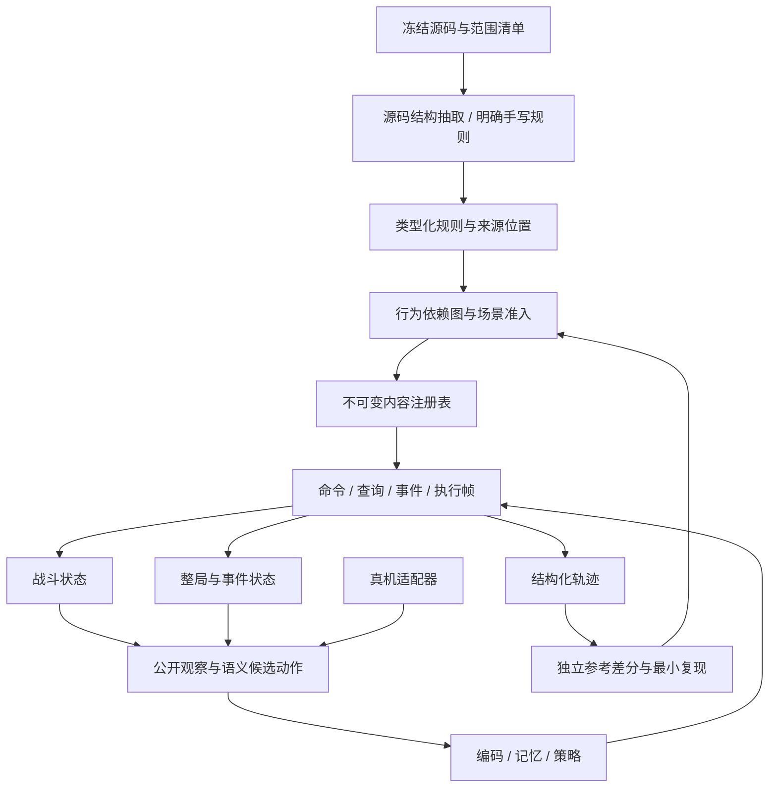

> 🗄️ **已归档（不再维护）。**9/19 的缺口复核与填充批次已并入新 docs/13 的 §16 起各章。
>
> 合并去向：[13-实施规划与当前缺口.md](../13-实施规划与当前缺口.md)。
> 文中的完成度数字、结论与"下一步"都停留在写作当时；文内的 docs/NN 引用按**当时编号**，
> 不保证现在还能解析。要当前状态请看 [docs/08](../08-代码地图与运行说明.md) 的命令、
> [docs/13](../13-实施规划与当前缺口.md)（计划）与 [docs/12](../12-审计与整改记录.md)（整改）。

# 16 · 内容填充前的缺口复核、架构与技术规划

日期：2026-09-19。**本文是当前代码审计及下一阶段实施设计；本轮未修改模拟器、抽取器或训练代码。** 审计期间工作区发生了外部代码更新；下文将早期快照与交付前复核分开，已更新的结论不再作为未实现项。

接续 [完整规划](D:/桌面/尖塔模型/docs/13-完整模拟器与训练实施规划.md)、[整改记录](D:/桌面/尖塔模型/docs/14-审计整改记录.md) 与 [内容核对](D:/桌面/尖塔模型/docs/15-已实现内容核对-2026-09-19.md)。旧文档中的完成数字和“下一步”建议，以本文重新执行及源码复核的结果为准；已有历史记录保留。

**结论：保留 Python 数值模拟器，先修准入与 Run 集成，再补实例状态、可暂停执行、条件与查询钩子、观察编码，按机制批量填充内容。现在还不适合直接把剩余卡牌逐张塞进效果表，也没有证据支持先整体改写成 Rust/C++。**

范围继续沿用固定游戏版本、单人、铁甲战士与低进阶优先，然后扩展完整幕流程和其它角色。允许重开是正式需求。环境内部可以持有随机状态，策略、搜索和记忆只能使用玩家可见信息及先前尝试真正观察过的历史。接入方式仍为内存/Mod 或画面，两者共用决策协议。

## 1. 当前基线：已取得进展，但覆盖数字仍有假阳性

### 1.1 本轮实际执行

| 检查 | 结果 | 可以证明什么 |
|---|---|---|
| `python -X utf8 tools/content_status.py` | 正常完成，见下表 | 当前加载器及准入规则给出的覆盖情况 |
| `python -X utf8 tools/verify_implemented.py --sample 8` | 八项通过 | 引擎采用的数据与同一套抽取记录一致；不能证明抽取语义正确 |
| `python -X utf8 tools/architecture_audit.py` | 正常完成 | 当前模块与源码的结构盘点 |
| 首轮 `python -m pytest tests -q` | **收集失败**：`test_run.py` 导入不存在的 `mapgen.DEFAULT_COLS` | 早期快照的问题；随后工作区更新了测试，交付前已重新执行全量检查 |
| 排除该文件后运行其余测试 | **687 passed、2 skipped、350 subtests passed**，43.99 秒 | 其余测试未发现回归；不是全量通过，也不是修复方案 |
| 工作区更新后重跑 `python -X utf8 -m pytest tests -q --maxfail=2` | **757 passed、2 skipped、350 subtests passed**，60.95 秒 | 当前快照全量测试通过；新增反例仍说明现有测试覆盖不完整 |
| 针对性只读探针 | 复现 Normality、Run 奖励门禁、编码遗漏；地图进阶传参问题在后续工作区更新后已消失 | 见第 2 节与附录 |

第二次测试命令为 `python -X utf8 -m pytest tests -q --ignore=tests/test_run.py --maxfail=4`。排除文件仅用于定位其余部分状态；交付前第三次运行已恢复全量测试，并确认旧的收集失败已消失。

### 1.2 覆盖快照

| 内容 | 当前工具报告 | 解读 |
|---|---:|---|
| 卡牌 | 254 / 597 可执行，332 张标记残缺 | **254 是门禁输出，不是已认证正确数**；Normality 已证明存在误放行 |
| 铁甲战士卡池 | 58 / 90 合格；奖励可抽池 53 张 | 基础牌等不属于奖励稀有度，因此两个数字不同 |
| 怪物 | 115 / 115 挂接状态机 | 不代表全部条件分支、召唤、死亡与交互已验证 |
| 能力 | 95 / 267 有实现，工具报告 75 个有测试覆盖 | “出现过测试”与完整语义覆盖不同 |
| 遗物 | 86 / 299 有行为，82 被标为完全复刻 | 条件、记账依赖及 Run 副作用仍需审计；旧文档 92 / 85 已过时 |
| 遗物钩子缺口 | 111 种、291 处 | 工具分类为 245 处直接行为、46 处记账；记账不能直接视为无关 |
| 药水 | 45 / 65 可用 | 不等于所有选择、目标和组合都已验证 |
| 事件 | 22 / 68 可跑，第一幕池 18 个 | 附魔涉及 9 个、事件战斗涉及 5 个、未抽出选项 11 个；类别有重叠 |
| 遭遇 | 普通 55、精英 12、Boss 12 个被准入 | 还需幕、解锁、进阶和生成依赖限定 |
| 真机轨迹验证 | 当前报告为 0 | 内容完成与迁移能力仍无独立参考执行证据 |

卡牌拒绝原因报告为：`effects_incomplete=332`、`unimplemented_power=250`、`effects_from_community_text=174`、`no_effects=90`、`closure_gap=4`、`triggers_incomplete=3`、`unsupported_op=1`。**同一张卡可以同时命中多个原因，不能相加。**

这些分母混合了社区表与本地源码索引。源码目录统计为 596 个卡类、268 个能力类、300 个遗物类、121 个怪物类；与运行表条数不完全相同。下一阶段先建立目标范围清单，区分正式单人内容、多人专属、废弃类、占位类、版本差异。不能为了凑齐分母强行纳入所有类。

已完成部分应保留：Run/战斗永久牌关联、角色初始参数、药水动作、选择候选一致性、手牌上限、部分怪物条件、伤害阶段、挂起后的出牌钩子，以及内容指纹框架。新工作围绕缺口推进，不推倒这些实现。

## 2. 本轮确认的重点缺口

### G01 · 准入只检查部分行为，且尚未覆盖所有内容入口【P0】

**实例一：Normality。** [源码](D:/桌面/尖塔模型/data/decompiled/sts2/MegaCrit.Sts2.Core.Models.Cards/Normality.cs) 通过 `ShouldPlay` 查询本回合已开始的出牌次数，卡在手中且次数达到 3 时阻止继续出牌。当前 `card_admission("normality").admitted` 为 True；把 Normality 与四张防御放进手牌，能量设为 10，依次打出三张防御，第四张仍在合法动作里。

原因是 [准入](D:/桌面/尖塔模型/sts2_sim/eligibility.py) 的“不可打出牌”例外与 [合法动作](D:/桌面/尖塔模型/sts2_sim/core.py:446) 未覆盖卡本身的全部查询行为。**不能将不可打出等同于只有占手牌作用**。暂时拒绝这种内容，比只修掉一张卡更应优先形成通用规则。

**实例二：Run 奖励。** [draw_card_reward](D:/桌面/尖塔模型/sts2_sim/run.py) 从角色原始池采样，没有使用战斗课程同一套准入。在 `RngSet(0)` 上生成 `iron_wave / thunderclap / demonic_shield`，其中 `demonic_shield` 被准入拒绝。后续商店、转化、生成、遗物包、事件及召唤入口均应逐项检查，不能由 PPO 的池子已过滤推断 Run 全部已过滤。

设计要求：把“内容本身可执行”“当前场景允许出现”“训练课程允许出现”分别定义，所有入口共享其交集。真实分布验证模式遇到不支持内容必须记为 **unsupported 场景**，不能悄悄重抽；受限课程可以预先缩池，但必须记录被改变的分布。

### G02 · 观察中有字段，不代表模型能使用【P0】

[featurize.py](D:/桌面/尖塔模型/sts2_sim/featurize.py) 对能力仍只编码 strength、vulnerable、weak。保持其余观察和合法动作不变，把玩家中毒从无改成 9 层，所有编码数组逐元素相同；把 `orb_slots` 增加 2，编码也完全相同。

遗物当前主要编码身份，缺少公开计数；卡实例成长、临时费用与附魔尚无完整观察模型。先修这些，再开放相应内容。测试必须一路覆盖 `运行状态 → Observation → 数组 → 网络实际输入`，不能只检查 JSON 字段存在。

### G03 · 地图与多幕已开始贯通，奖励和后继流程仍需补齐【P1】

[mapgen.py](D:/桌面/尖塔模型/sts2_sim/mapgen.py) 和 [acts.py](D:/桌面/尖塔模型/sts2_sim/acts.py) 已引入源码地图结构、幕定义、未知点、远古点、剪枝和双 Boss 参数，不能再把地图描述为旧的简单网格。

**交付前更新：**早期快照没有传入地图进阶、将未知点直接视为事件、首幕 Boss 后即通关。工作区随后更新了 [RunEnv](D:/桌面/尖塔模型/sts2_sim/run.py)、[pointodds.py](D:/桌面/尖塔模型/sts2_sim/pointodds.py) 及多幕测试：现在已传进阶、按幕选择地图、进入未知点时掷房间、支持 `_begin_act`。重新执行同种子探针，A0 为 61 个点且没有第二 Boss，A10 为 62 个点且第二 Boss id 为 61。以上旧缺口不再列为待实现。

**仍需处理：**非最终幕 Boss 的奖励与双 Boss 后继**已补齐**（本轮：非最终幕 Boss 先给三选一与金币，领完奖励才换幕；A10 先打第二个 Boss 才换幕；见 `docs/14` §7.2 与 `tests/test_multi_act.py`）。剩余两项：**远古点仍直接返回地图**（真机 `MapPointType.Ancient => RoomType.Event`，即开局远古事件），以及**幕遭遇仍从全局遭遇池逐节点抽样**，没有按源码 `ActModel.GenerateRooms()` 的弱怪/普通/精英队列与标签去重推进 —— 卡在"源码遭遇 id → 怪物成员"的桥没搭（`acts_source.json` 用源码 id，社区 `encounters.json` 用另一套 `eid`），装载时记为 `act_encounter_ids_pending_bridge`。

交接探针用模拟的 `done=True, won=True` 战斗结果单独测试 Run 后继逻辑：seed=1 时首幕 Boss 已生成 `cascade / crimson_mantle / midnight` 奖励，但 A0 直接进入 act=2/map；A10 即使 `second_boss=61` 也直接进入 act=2/map。此探针证明 Run 分支问题，不声称实际打赢了该战斗。

因此下一步是验证并补齐 `幕计划 → 地图 → 房间解析 → 幕队列 → Boss 奖励/第二 Boss → 下一幕`，不是重新开发已加入的地图和未知点基础算法。地图同种子一致性与未知点修正规则仍需独立参考验证。

### G04 · 成长机制需要实例状态，不能由变量名猜行为【P1】

旧文档建议把五张 `Increase` 卡统一建模为“每次打出递增”，源码并不支持这个统一方案：

| 源码对象 | 实际规则 | 共用能力与专属差异 |
|---|---|---|
| [Rampage](D:/桌面/尖塔模型/data/decompiled/sts2/MegaCrit.Sts2.Core.Models.Cards/Rampage.cs) | 伤害结算后提高**这一个实例**的伤害 | 实例变量、出牌后修改；升级/降级不能抹掉累计量 |
| [Claw](D:/桌面/尖塔模型/data/decompiled/sts2/MegaCrit.Sts2.Core.Models.Cards/Claw.cs) | 结算后提高当前 `AllCards` 中所有 Claw 实例伤害 | 同类实例查询；增量由本次打出的牌决定，升级值不同 |
| [Maul](D:/桌面/尖塔模型/data/decompiled/sts2/MegaCrit.Sts2.Core.Models.Cards/Maul.cs) | 两次命中后强化当前所有 Maul | 命中次数与强化次数分开，不能每段伤害都强化 |
| [KinglyPunch](D:/桌面/尖塔模型/data/decompiled/sts2/MegaCrit.Sts2.Core.Models.Cards/KinglyPunch.cs) | **抽到自身时**增加伤害 | `AfterCardDrawn`，不是 OnPlay |
| [TheBall](D:/桌面/尖塔模型/data/decompiled/sts2/MegaCrit.Sts2.Core.Models.Cards/TheBall.cs) | 实例成长，并有跨玩家归属/牌堆移动 | 声明 `MultiplayerOnly`；单人目标范围先排除 |

当前 [CardInstance](D:/桌面/尖塔模型/sts2_sim/core.py:46) 有 cid、升级、uid、苦痛、永久牌关联，但还没有上述可变伤害和作用域。共享的是“可变实例 + 选择集合 + 触发时机”，不是同一条加伤公式。

### G05 · 记账会影响未来结果，必须纳入行为闭包【P1】

[Kunai](D:/桌面/尖塔模型/data/decompiled/sts2/MegaCrit.Sts2.Core.Models.Relics/Kunai.cs) 的回合开始清零、攻击计数与整除触发共同构成规则；[HappyFlower](D:/桌面/尖塔模型/data/decompiled/sts2/MegaCrit.Sts2.Core.Models.Relics/HappyFlower.cs) 的 TurnsSeen 是保存属性；[ArtOfWar](D:/桌面/尖塔模型/data/decompiled/sts2/MegaCrit.Sts2.Core.Models.Relics/ArtOfWar.cs) 的布尔记账决定下回合能量。

当前分类把 bookkeeping 与直接效果分开，有助于统计；但 [effectful_gaps](D:/桌面/尖塔模型/sts2_sim/content.py:1764) 将记账排除，**不能由此得出可以不实现这些写入**。只有证明某字段仅影响动画/显示，且不存在规则读取，才可以忽略。

同样，“单人恒真”要有明确前置条件。`participants.Contains(Owner.Creature)` 在玩家侧与敌人侧回调中的真假不同；只有分发器已经限定到正确阵营时才可省去，不能仅凭单人模式批量剥离。这里是需要补验证的架构风险，不宣称已复现每个遗物因此出错。

### G06 · 扁平效果列表和单个 pending 无法承载后续组合【P1】

当前有选择挂起、自动出牌和部分续跑能力，但 [core._apply_effects](D:/桌面/尖塔模型/sts2_sim/core.py:961)、[事件续页](D:/桌面/尖塔模型/sts2_sim/events.py:1003) 仍是分散的恢复路径。选择触发消耗、消耗触发抽牌、抽牌触发另一张卡，再嵌套选择时，需要保存父子执行位置与局部变量。

需要小型、可序列化的执行帧栈；不需要复刻动画协程。挂起必须发生在明确决策边界，不能在恢复时重放已执行副作用。

### G07 · RNG 与整局分布仍不相同，源码已足够开始补齐【P1】

[rng.py](D:/桌面/尖塔模型/sts2_sim/rng.py) 仍使用 SHA-256 派生和 Python random。其“没有反编译出 MegaRandom”的注释已经不成立：本地存在完整 [MegaRandom.cs](D:/桌面/尖塔模型/data/decompiled/sts2/MegaCrit.Sts2.Core.Random/MegaRandom.cs) 与 [Rng.cs](D:/桌面/尖塔模型/data/decompiled/sts2/MegaCrit.Sts2.Core.Random/Rng.cs)。

此外，[start_combat](D:/桌面/尖塔模型/sts2_sim/core.py:1652) 每次新建 RNG 集；Run 逐节点预掷奖励，并以固定稀有度表抽取。源码 [ActModel.GenerateRooms](D:/桌面/尖塔模型/data/decompiled/sts2/MegaCrit.Sts2.Core.Models/ActModel.cs:331) 维护弱敌/普通/精英队列与去重标签；[CardRarityOdds](D:/桌面/尖塔模型/data/decompiled/sts2/MegaCrit.Sts2.Core.Odds/CardRarityOdds.cs) 维护会随奖励变化的概率状态。只匹配流名不能使这些分布等价。

### G08 · 证据、训练和真实接入仍有独立缺口【P1/P2】

现有数值核对从自己生成的抽取表取期望值，无法检出双方共享的遗漏；Normality 是现成反例。指纹工具采用硬编码文件列表；审计早期漏掉 acts.py，交付前工作区已经补入 acts.py 和 pointodds.py，因此不再记作当前漏项。为避免今后新增文件再次漏记，仍建议使用明确包范围的文件发现或生成清单。

网络仍是无循环记忆的 Entity Transformer；Run 没有统一的神经决策编码。SL 记录主要是各回合开始手牌，漏掉回合内抽牌等实际可见事件；`env._finalize` 直接恢复最佳结果快照。训练可以保留 best-of-K，但真机执行还需要“重开并重放最佳动作序列”，并验证能到达同一公开结果。

## 3. 内容填充所需的最小架构



### 3.1 保留现有职责，按能力逐步提取

| 层 | 现有落点 | 下一步边界 |
|---|---|---|
| 内容定义 | `content.py`、`data/content/repo` | 保留静态表加载；新增规则版本、源码 span、所需能力、未解释片段 |
| 运行规则 | `core.py`、`powers.py`、`hooks.py` | 共用命令执行与查询；复杂内容使用显式注册的手写处理器 |
| 执行恢复 | 当前 pending / 自动出牌路径 | 新增小型 `execution.py`，旧效果列表作为顺序程序适配进去 |
| 实例修改 | `CardInstance`、永久牌回写 | 按实际需求扩展实例字段及生命周期，不用全局 cid 状态替代实例 |
| Run 流程 | `run.py`、`acts.py`、`events.py` | 幕与房间状态机、事件战斗返回点、奖励/概率持久状态 |
| 内容准入 | `eligibility.py` | 统一内容图、场景 profile、所有生成入口 |
| 观察/动作 | `observe.py`、`featurize.py` | 可见实例属性、能力/计数实体、变长候选，观察局部引用 |
| 验证 | `tests/`、现有审计工具 | 独立源码用例、执行轨迹、来源证书；共用生产抽取器的检查仅算管线检查 |

新增文件按首个实际用例创建；不预先搭建插件系统、通用游戏框架或全功能 C# 解释器。加载后的注册表在一次训练运行中冻结，内容变化重建准入缓存与词表。

### 3.2 状态生命周期

| 状态 | 所属层与存活范围 | 重开/战后行为 |
|---|---|---|
| 卡牌基础定义、规则程序 | 内容注册表，不可变 | 不写入单局状态 |
| 永久升级、附魔、永久变量 | Run 的卡实例，按唯一实例关联 | 跟随节点存档恢复；战后仅提交明确永久变更 |
| Rampage/Claw 等成长、临时费用、苦痛 | 战斗卡实例/具名 modifier | SL 恢复；按源码规定在回合/战斗边界过期 |
| 出牌/抽牌/引球历史及索引计数 | 战斗历史，按事件类型和 actor 索引 | SL 连同环境回滚；回合计数按准确时机重置 |
| HappyFlower 等持久计数 | 遗物实例的 Run 状态 | 跨战斗保留；SL 跟随节点状态恢复 |
| 效果局部变量、循环下标、待选择 | 执行帧 | 任意合法决策边界均可保存/恢复 |
| 幕队列、遗物包、奖励概率、随机流 | 环境 Run 私有状态 | 连同节点快照恢复，不进入策略 |
| 已经观察过的动作/结果 | 策略可见历史 | 重开不清除；新 meta-episode 清除 |

卡实例增加 `dynamic_values`、带作用域的费用/数值修正、附魔实例；每个字段有白名单 schema、默认值和过期规则。不能塞入任意 Python 对象。复制规则显式说明复制哪些属性、是否保留永久关联、是否继承成长；新生成卡不能自动继承旧实例成长。升级/降级按源码更新基础值并保留应保留的累计值。

### 3.3 受限表达式与控制流

实现有限的、可检查的规则表示，支持如下实际需求：

| 能力 | 最小表达 |
|---|---|
| 数值 | 常量、实例变量、公开/内部环境字段读取、加减乘除、min/max、显式取整 |
| 条件 | 比较、与/或/非、牌型/阵营/来源/是否同一实例 |
| 集合 | 按牌堆/类型/所有者过滤，计数，按源码顺序枚举 |
| 状态修改 | 指定实例/计数器的赋值与增量，必须声明作用域 |
| 控制流 | Sequence、If、Repeat、ForEach、Return |
| 决策与随机 | Select、具名流 Sample；两者必须独立，玩家选择不能变成随机选择 |

示意：Rampage 是 `Damage(self.damage)` 后 `AddInstanceVar(self, damage, self.increase)`；Claw 的第二步是查询当前 AllCards 的 Claw 集合后逐个修改；KinglyPunch 把修改程序挂在 `AfterCardDrawn(card == self)`。

运行期表达式可以在环境内部查询其合法规则所需状态；只有白名单投影才能离开环境。禁止把任意源码字符串 `eval` 成 Python。遇到未识别语句、未解析目标、缺失分支，编译该内容失败并留下原因，不返回 0、不默认 false、不删掉未知语句后继续认证。

[Voltaic](D:/桌面/尖塔模型/data/decompiled/sts2/MegaCrit.Sts2.Core.Models.Cards/Voltaic.cs) 的循环次数先从此前的引雷球历史计算并捕获，再执行引球；不能每次循环重新读取正在增长的计数。Normality 的计算变量涉及描述展示，但真正限制来自 `ShouldPlay`。因此必须盘点完整方法和字段读写，变量名出现于 JSON 不是语义完整证明。

### 3.4 可暂停执行算法

帧最少保存 `program_id、pc、source_ref、target_refs、locals、parent、phase`。循环边界、命中次数、捕获的 X 值和选择返回值都放在帧中；引用以环境内部稳定实例 id 表示，序列化时不能依赖内存地址或 Python generator。

执行流程：取栈顶 → 执行一步或压入子帧 → 子帧完成后恢复父帧 → 遇 Select 发布选择请求并暂停 → 动作校验后写回选择结果并续跑。选择请求保存不可变候选引用、数量范围、可否跳过及顺序语义；UI 展示位置只是当前候选的局部索引。

手动打牌、自动打牌、药水、遗物和事件调用相同执行器。命令完成、一次命中、一次打牌完成分别发事件；普通 `AfterCardPlayed` 全部完成后再进入 Late 阶段，依据 [Hook.cs](D:/桌面/尖塔模型/data/decompiled/sts2/MegaCrit.Sts2.Core.Hooks/Hook.cs:278)，不能对每个监听者混合执行普通与 Late。

步数上限只用于判定引擎故障/训练截断，不把超限当输牌或强行跳过效果。每次恢复应通过“无暂停执行 vs 任意决策点存取后执行”的状态与轨迹比较。

### 3.5 钩子与行为依赖

区分命令（改变状态）、事件（通知已发生）、查询（决定是否合法/数值）、派生显示（不改变规则）。同一内容可以拥有多种行为。

对每个行为记录：触发时机、作用对象、guard、读取字段、写入字段、调用命令、阶段与排序依据。字段写入只要被规则读取，就必须作为该规则的依赖。例如 Kunai 的“清零 → 计数 → 判模 → 加敏捷”是一组不可拆开的功能；不能只采纳加敏捷部分。

查询入口优先补 `ShouldPlay`、费用修正、目标合法性、抽牌数、奖励/药水/金币获取限制。出牌前检查与实际执行使用同一查询接口，自动出牌也遵守其适用规则。当前遗物“某些战斗缺口阻止数值半边”的策略应扩为整条行为依赖检查，覆盖 Run 代价。

伤害继续使用明确阶段：来源基础值、加法、乘法、限制、源码指定舍入和伤害类型；逐段伤害分别处理格挡、死亡与反击。不用“相同最终总伤害”替代“相同命中序列”。先使用 Decimal 等明确数值语义；若源码用 float/int，则保持相应类型，不将所有字段一律转 Decimal。

### 3.6 内容图与准入算法

图节点不只是一张卡，而是“内容 + 变体/行为 + 适用场景”；边包括生成牌、召唤物、施加能力、选择用途、附魔、随机池、查询与记账依赖。随机池依赖目标范围内所有可能成员，动态无法界定的池必须阻止完整准入。

采用反向依赖传播：先将缺实现/缺解析/范围不符节点标为不合格，再沿反向边传播；循环依赖可先求强连通分量，内部局部能力都满足且没有不合格外部依赖时才允许。不是遇到递归就默认通过。输出最短阻断链，例如 `事件 → 附魔 → 费用查询未实现`。

优先级依据“修复后实际新增的目标范围闭包可用场景 / 工作量”排序，再结合起始牌组、常见奖励、核心流派的使用频率；使用待修集合的去重并集，避免将一张卡的多个 blocker 重复算收益。图中假设可修复不等于已经获准，必须重新跑源用例和入口检查。

## 4. 内容填充批次与交付依赖

下面是机制顺序，不承诺未经闭包分析的“完成这批必定解锁 N 张”。第一角色仍以铁甲战士为主；Claw/KinglyPunch 等作为跨角色语义探针使用，不代表同时开启五角色训练。

| 批次 | 工作与样例 | 前置 | 验收产物 |
|---|---|---|---|
| B0 基线收口 | 验证新测试集成、修 Normality 准入、Run 奖励入口、指纹自动覆盖、编码遗漏 | 无 | 全量测试通过；新增反例回归；所有入口清单及状态 |
| B1 实例与历史 | Rampage；抽牌/出牌/伤害/引球事件；卡修改生命周期 | B0 | 状态 schema；同名实例不串值、跨战斗不误保留、SL 正确恢复 |
| B2 执行帧与查询 | 嵌套选择/自动打牌；Normality 的 ShouldPlay；事件续页 | B1 | 单一可恢复执行器、公开选择协议、动作与查询一致 |
| B3 条件遗物与能力 | Kunai、HappyFlower、ArtOfWar；牌型/阵营/计数/数值查询 | B1+B2 | 成组行为认证；各边界前后与跨战斗用例 |
| B4 集合与动态公式 | Claw、Maul、KinglyPunch、Voltaic；造牌/复制/放回/临时费用 | B2+B3 | 集合/历史表达式、升级和复制矩阵、生成闭包 |
| B5 永久改牌与事件 | 附魔、删牌/升级/转化、生成候选选取；事件战斗返回 | B2+B4 | 永久修改协议、事件→战斗→奖励/原页面完整轨迹 |
| B6 Run 分布闭环 | RNG、幕房间队列、未知点修正与对拍、奖励概率、商店、远古、Boss 后继流程 | B0 后可先做底层；依赖 B3/B5 完成交互 | 复用已加入的多幕/未知点基础实现；每个节点真实入口均通过准入 |
| B7 角色和高进阶 | 铁甲完整范围之后，再逐一开放其它角色机制、进阶、遭遇 | 对应机制及 B6 | 每个 profile 独立范围证书，不以总数替代 |
| B8 训练迁移 | 序列 PPO、整局策略、有限预算搜索、真机控制 | 协议稳定；对应训练范围通过验证 | 分组评估、SL 最佳轨迹重放、闭环真机轨迹 |

B0 不能靠只加特殊名单收工：Normality 先隔离以止损，再做“卡的所有覆写方法是否纳入规则”的通用检查。B1/B2 做最小样例贯通后即可填一批内容，不必等整个规则表示支持所有 C# 写法。

能力剩余 172 种应按读写/触发需求分组：基础数值修正 → 回合/出牌触发 → 历史与实例 → 角色专属 → 跨阶段复合。不要只按 apply_power 被引用次数排序，因为卡解析失败时它的依赖可能还没进入当前效果列表。

事件按普通单页 → 多页条件/累计状态 → 选牌和永久修改 → 事件战斗 → Ancient 推进。怪物后续重点是可达招式、强制转移、历史限制、召唤后的依赖、复活/不可选中状态与进阶参数；“115 个状态机都挂上”不能成为停止补测的理由。

## 5. Run 与 RNG 的实现算法

1. **统一随机后端。** 移植本地 MegaRandom 的初始化、无符号溢出、旋转、整数拒绝采样和浮点输出；从 Rng/StringHelper/RunRngSet/PlayerRngSet 逐条对齐派生方式。对照独立 C# 小程序产生固定测试向量。不能仅套用同名 xoshiro 库就宣称一致。
2. **随机流属于 Run。** 战斗借用规定的持久流；明确地图/事件独立流的创建与保存时机。每次随机请求记录用途、操作、参数、逻辑调用序号；调试日志不进入策略进程。不同后端底层消耗次数未必相同，逻辑 calls 计数相同不是位级对齐证据。
3. **幕内内容用队列/抓包与约束。** 按弱遭遇、普通、精英及标签去重生成，保留源码池顺序和洗牌顺序。地图展示结构与实际房间内容分开；未知点在规定时机用动态 odds 解析。
4. **奖励按规则时机生成。** 卡稀有度状态、药水概率、遗物包、商店及转化分别持久化。先匹配生成与状态修改时机，再检查 RNG 消耗；不能把所有未来奖励提前独立填进节点。
5. **明确终止。** 普通战斗胜利、事件内战斗、幕 Boss、第二 Boss、最终通关各有不同后继状态。事件战斗使用显式 combat context 和返回帧，奖励来源由事件/房间契约决定，不能查不到地图节点就给空奖励。
6. **解锁配置可复现。** 初期采用有名字的测试 profile，如限定角色/幕/内容的课程配置；实际账号解锁未知时不声称其分布等于真机。后续适配器读取允许的解锁信息，或使用用户明确提供的配置。

同种子对齐用于开发对拍，不要求策略知道游戏种子。策略生成未来假设时应使用独立采样的随机状态，而不是复制真机隐藏状态。同一公开历史可以对应多个未来；怪物状态机存在随机和条件分支时也如此。

## 6. 技术栈决策

### 6.1 实测环境与近期选型

当前可用环境：Python **3.11.4**、NumPy **2.4.6**、PyTorch **2.5.1+cu121**、pytest **9.1.1**，`torch.cuda.is_available()` 为 True；.NET SDK **9.0.314**。这些是本机观察值，不代表已完成依赖锁定或推荐升级版本。本轮没有安装依赖，也没有验证 GPU 性能。

| 环节 | 近期采用 | 推迟/触发条件 |
|---|---|---|
| 数值内核 | 现有 Python，dataclass、枚举、显式处理器 | profile 证明热点后再移植热点；近期不整体换语言 |
| 内容格式 | 版本化 JSON、具名规则与来源 span；十进制值用无损字符串表示 | 内容量不要求数据库服务；需要聚合时用标准库 SQLite 即可 |
| C# 结构抽取 | 小型 .NET CLI + Roslyn 语法树，先用于方法/条件/赋值/循环覆盖审计 | 不要求编译整个反编译游戏；符号不明、语法损坏则诊断并拒绝自动转换 |
| 复杂机制 | Python 手写具名 handler，与自动规则共用命令/帧/测试 | 不追求自动翻译任意 C#；所有手写规则仍绑定来源和验证案例 |
| 训练 | 保留 NumPy + PyTorch；CPU 采样、GPU 批量策略 | 先单进程基准，再按 Windows spawn 多进程扩展；暂不引入分布式训练框架 |
| 轨迹与差分 | JSONL、稳定状态归一化、pytest；先记录决策边界与关键原子事件 | 体积实测过大再换二进制格式，不先搭数据平台 |
| 工程复现 | 新增 pyproject/锁定依赖与运行 manifest，记录 CUDA/协议/profile | 先固定现有能运行的组合，不顺带升级训练栈 |
| 真机接入 | C# Mod/内存白名单适配器优先，截图适配器输出同一协议 | 先只读对拍，再开放动作执行；OCR/图像模型待真实帧样本确定 |

Roslyn 官方 API 提供解析与遍历 C# 语法树的能力，适合保留 `if/foreach/assignment/return` 的结构；**解析成功不等于语义翻译正确**。采用 CLI 导出 JSON，避免训练运行时依赖 .NET 进程。[Microsoft：语法分析](https://learn.microsoft.com/en-us/dotnet/csharp/roslyn-sdk/get-started/syntax-analysis)

这是一项渐进替换：旧抽取器继续服务已有条目，新审计器先输出“哪些方法/语句未处理”；优先迁移成长卡、条件遗物、动态公式三个问题簇。反编译源码含生成名称或缺依赖时，保留诊断并用明确手写处理器；不因完整项目编译失败阻塞内容填充。

### 6.2 性能路线

分别测量 `纯 step`、观察编码、策略推理、快照恢复、内容加载和执行轨迹开销；报告固定工作负载下每秒决策数、峰值内存、P50/P95 延迟。至少覆盖简单战斗、嵌套选择/生成、长战斗 SL，不能只测空回合。

先优化重复解析、内容缓存、无用 deepcopy 和批量编码。快照初期用正确且可验证的显式状态复制；若重开/搜索成为热点再考虑不可变共享或增量日志。只有热点明确且一致性用例通过后，才评估 C#/Rust/C++ 的小范围加速。GPU 负责策略网络，复杂分支模拟不默认搬到 GPU。

## 7. 训练与内容填充如何配合

### 7.1 网络接口先补完整，再加规模

沿用当前约 128 维、3 层 Transformer 作为初始基线，不预设增大模型。增加能力 token（类型、层数、所有者）、遗物公开计数、卡可见动态值/费用/附魔、球槽与球的公开状态；牌堆按公开可见的实例属性多重集表达，不暴露隐藏顺序。

动作由环境产生合法语义候选，候选引用当前观察中的实体/选择项；使用候选向量评分。动态 batch padding 取代依赖固定 64 动作的长期设计；过渡期超容量必须报错，不能截断。选择数量较大时可逐项选择并提供合法完成动作，是否有顺序意义由源码决定。

增加 GRU 维护动作后公开事件和 SL 历史，跨 restart 保留记忆，跨新 meta-episode 清空。训练保存序列、mask、burn-in、重开边界与终止/截断标志；不能把循环网络加入当前随机打散的 PPO minibatch 后就算完成。环境重开与策略记忆重置必须使用不同标志。

### 7.2 训练阶段

1. 规则 bot 跑通过认证的受限战斗集，统计 unsupported/故障与合法动作问题；不先把所有失败当作策略输牌。
2. 可选 BC：规则或有限预算搜索生成轨迹，所有搜索只访问公开观察及独立假设状态。先在留出场景检验示范是否比规则基线更好。
3. 战斗 PPO：冻结内容 manifest，学习出牌、选择、药水和结束回合；循环记忆加入后按完整序列训练。环境仍有缺口时只声明受限课程性能。
4. SL 课程：从 K=1 扩展至预设有限预算（例如 K=2/4），保留每次可见动作/结果。按 meta-episode 结算最佳尝试与操作成本，不能每次重开重复领取通关奖励；价值目标对应当前预算及选择规则。
5. Run 训练：在幕/奖励/事件完整范围通过后，加入路线、奖励、商店、营火和事件候选，战斗策略先冻结作为稳定基线，再逐步联合训练。
6. 搜索与蒸馏：使用 belief 中的独立未来样本做短程 beam/树搜索，按动作共享样本集合降低比较方差；限制节点数/毫秒数，最后蒸馏到策略。不得从 live `Hidden` 克隆未来；自博弈不是单人 PvE 的主要方法。

若策略根据以往重开观察推断某段牌序，应保留“在何种动作历史下看到”的条件。改变随机消费路径或重新洗牌后，旧结果不能被当作当前未来必然发生。搜索遇到等价公开历史时不能按不同隐藏样本为策略提供不同动作信息，这是避免隐藏信息泄漏的关键测试。

奖励以胜负、剩余生命、资源与明确操作成本为主，过程塑形使用公开状态势函数；失败试次的伤害/收益不能简单跨重开累加刷奖励。死亡、引擎异常、时间截断和 unsupported 分开统计，截断 bootstrap 规则与真实终止分开。

### 7.3 验证训练是否有效

按起局种子族、牌组/遗物组合、遭遇与角色 profile 划分训练和留出集，同一局的 SL 尝试不得跨集合。冻结 manifest 的规则基线、BC、无记忆 PPO、序列 PPO 用相同评估集比较。

必须报告 K=1 和相同 K/操作预算下的成功率、尝试数、用时、生命/资源、故障率及置信区间。统计独立单位是起局/meta-episode，不能把重开尝试当独立样本扩大样本量。受限池与真实目标池的结果分开，不能通过移除难牌/难怪制造“胜率提升”。

最佳尝试落地方式：保存可见动作序列及决策边界摘要，真实游戏重开至对应节点后按序重放；每步核对观察和候选，发生差异立即重新决策并记录，不能声称已实现模拟器中直接恢复快照的结果。

## 8. 验证方法与交付门槛

### 8.1 四类证据分别记账

| 证据 | 方法 | 不能替代的部分 |
|---|---|---|
| 管线一致性 | 现有 verify_implemented、schema、内容哈希 | 不验证遗漏的条件/赋值/方法 |
| 源码行为用例 | 人工从 C# 独立推导最小输入和完整执行结果 | 不等于完整游戏运行，也不是用同一抽取表生成期望 |
| 独立组件参考 | 小型 C# RNG/概率/规则 harness，来源与变更有记录 | 不自动证明 Godot 整体调度和跨模块时序 |
| 真机差分 | 同版本真机采集公开决策状态、合法动作和事件序列 | 当前尚无这一层，必须单列待完成 |

每个内容证书记录来源哈希、适用角色/进阶/变体、依赖、案例、轨迹、已知限制；源码或依赖变更后沿反向图撤销相关证书。让已有针对性源码用例真正提升相应内容的 source_case 状态，不应因还没真机对拍就将这层永远写 False。

### 8.2 首批验收案例

| 案例 | 必须检验的结果 |
|---|---|
| Normality 在手/不在手、2/3 次出牌 | 第四次出牌限制与源码一致；手动和自动路径均走查询，回合重置正确 |
| 两张 Rampage 与一张升级版 | 仅自身成长；复制/升级/降级、战后清理与 SL 恢复符合各自规则 |
| 多张 Claw/Maul 分布在不同牌堆 | 修改正确集合、增量来自本次来源牌、命中与强化次数分离 |
| KinglyPunch 回合内抽到/非抽牌移入手牌 | 只在对应抽牌事件触发；显示值与实际伤害一致 |
| Kunai 连续 2/3/4/6 次攻击，夹杂技能 | 计数、触发和跨回合清零正确；选择挂起时不提前记“完成” |
| HappyFlower 跨两场战斗与重开 | 持久计数正确；敌方回合不误增；显示值进入观察 |
| Voltaic 已引过 N 个雷球 | 捕获 N 后执行固定 N 次；不会因新引球再扩张循环 |
| 消耗→抽牌→自动打牌→选择 | 父帧位置、候选、After/Late 次数正确；恢复不重复扣能量或结算 |
| 事件→战斗→奖励/原事件 | 页面、永久状态、战斗结果和奖励归属均正确 |
| 改公开中毒/计数/成长/球槽 | 编码发生对应变化；改变隐藏牌序/随机状态而保持公开状态时编码不变 |
| 奖励/商店/转化/生成/召唤 | 每个入口尊重同一 profile；不支持内容不会静默运行或重抽 |

差分对齐按“决策边界 → 原子事件 → 状态变化”定位首个分歧，再缩短动作序列和内容组合得到最小复现。跨语言比较应归一化内部 uid、无语义日志与顺序无关集合；牌堆顺序等有语义数据不可随意排序。隐藏状态对比仅限受控开发参考，不能进入策略训练特征。

### 8.3 完成定义

- **M0：可继续安全填充。** 全量测试通过；G01/G02 已有修复或明确隔离；所有入口和版本指纹完整；无“八项通过即全部正确”的表述。
- **M1：机制扩展基座可用。** B1/B2/B3 最小样例及交互通过，帧可恢复、状态生命周期明确、公开编码完整；手工源码用例独立于抽取器。
- **M2：限定范围内容完整。** 在明确单人/角色/进阶/profile 内，所有可达内容及生成依赖闭包可用；不是全表达到某个百分比。
- **M3：整局与参考对齐。** 三幕/房间/奖励/SL 可贯通，组件参考通过，并有真机代表轨迹覆盖基础行为和组合。首版可设定固定回归集，数量不能取代语义覆盖。
- **M4：训练与接入有效。** 留出评估优于同预算基线，故障/unsupported 单列；真机闭环动作确认与最佳轨迹重放完成。

下一批最具体的工作顺序：**验证地图/Run 新集成及 Boss 后继流程 → 关闭 Normality 等被动规则漏检并统一入口 → 补能力/球槽/实例公开特征 → 用 Rampage 与 Kunai 驱动状态及帧/钩子基座 → 扩展内容簇与 Run 分布。** RNG 组件对拍可以与实例规则开发并行，但共享协议和注册表变更需要单一版本协调。

## 9. 审计快照与复现

源码程序集标识为 `0.1.0+41cef1ea4657c524aa50e870df009e56337e8c32`，反编译工程声明 `netcoreapp9.0`。这是本地源码标识，**不是已核实的用户 Steam build**。

以下使用现有 `tools.training_manifest._sha256_files` 算法，对路径、文件内容一起求哈希；引擎按完整包扫描。记录初次快照及交付前复核快照，以说明审计期间代码更新造成的差异；内容表与游戏源码哈希未变。

| 范围 | 文件数 | SHA-256 |
|---|---:|---|
| `sts2_sim/**/*.py`（早期快照） | 23 | `b3e54b64c25a43061501988b68f1ddb01733b35098e59d7b25353daf6cfd4f89` |
| `sts2_sim/**/*.py`（交付前复核） | 24 | `df378b1659676a53f82534163843f0c213400500e382797d7d62c36723b39d42` |
| `sts2_rl/**/*.py` | 3 | `95848bf85c6f2e128402ef2db46de8ac837a1ebe4ed653566ec987160286b7a2` |
| `data/content/repo/**/*.json` | 27 | `89cf051c37e84935025fb6d19accce88393442bf3eda6479733bfa3cf068df6e` |
| `data/decompiled/sts2/**/*.cs` | 3538 | `95b53c580e4cff31601a4a4e0c2fb9d735cf1b7049dcd31f04ddbc5d7c895a94` |

下面代码在项目根目录用 Python 执行，只构造内存局面，不修改内容文件。它复现 G01/G02/G03；正式修复后预期输出应相应改变。

```python
from dataclasses import replace
import numpy as np
from sts2_sim.featurize import configure_content, encode_observation

configure_content("data/content/repo")
from sts2_sim import eligibility
from sts2_sim.core import CardInstance, start_combat, legal_actions, step, Action
from sts2_sim.observe import observe
from sts2_sim.rng import RngSet
from sts2_sim.run import RunEnv, draw_card_reward

s = start_combat(eligibility.random_deck_cards(), ("axebot",), seed=1)
o = observe(s)
actions = legal_actions(s)
base = encode_observation(o, actions)
for name, changed in {
    "poison": replace(o, player_powers=o.player_powers + (("poison", 9),)),
    "orb_slots": replace(o, orb_slots=o.orb_slots + 2),
}.items():
    encoded = encode_observation(changed, actions)
    print(name, [k for k in base if not np.array_equal(base[k], encoded[k])])
# 当前两项均 []：公开状态变化没有进入编码。

reward = draw_card_reward(RngSet(0))
print("reward", reward,
      "rejected", [c for c in reward if not eligibility.card_admission(c).admitted])
# 当前 rejected = ['demonic_shield']。

s = start_combat(["defend_ironclad"] * 4 + ["normality"], ("axebot",), seed=1)
s.hand = [CardInstance("normality")] + [CardInstance("defend_ironclad") for _ in range(4)]
s.draw_pile = []
s.energy = 10
for _ in range(3):
    step(s, Action("play_card", 1, -1))
print("normality admitted", eligibility.card_admission("normality").admitted)
print("after three plays", legal_actions(s))
# 当前 True，且仍包含 play_card(hand=1,target=-1)。

for ascension in (0, 10):
    env = RunEnv(seed=1, ascension=ascension)
    env.reset()
    graph = env.raw_state.map
    print(ascension, graph.act_id, graph.second_boss, len(graph.nodes))
# 交付前更新后：A0 = overgrowth / None / 61；A10 = overgrowth / 61 / 62。
```

本规划没有把“当前未发现错误”提升为“已完整复刻”。后续以每批实际增加的闭包场景、独立验证证据和整局可达性作为进度依据。
